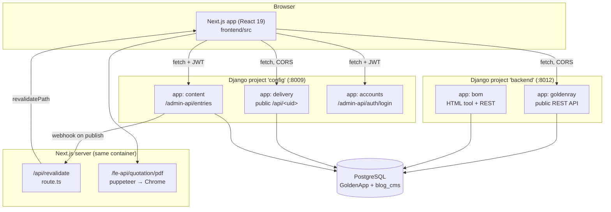
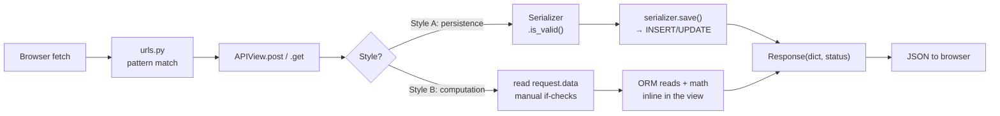
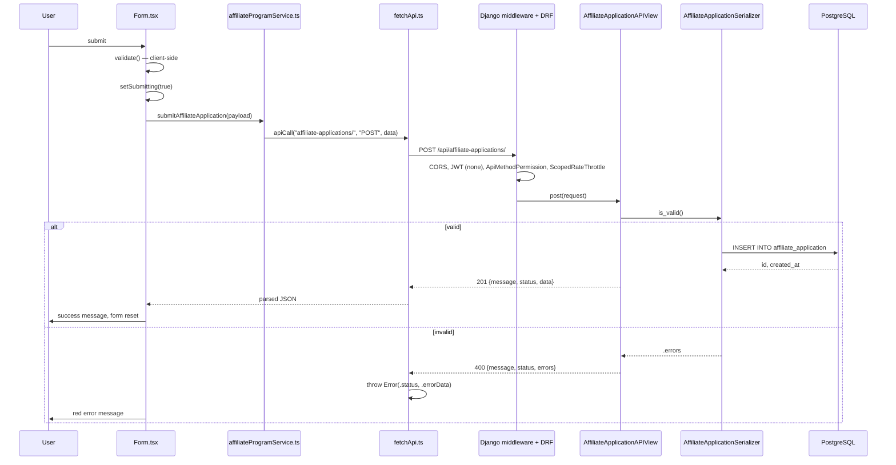
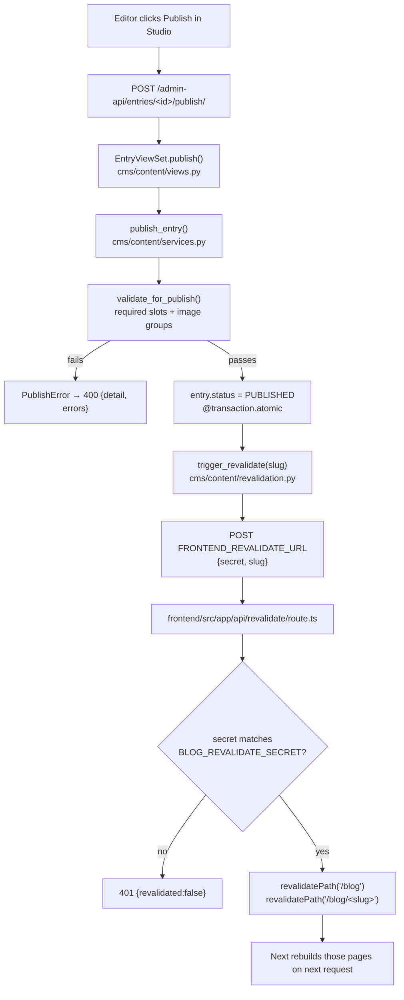
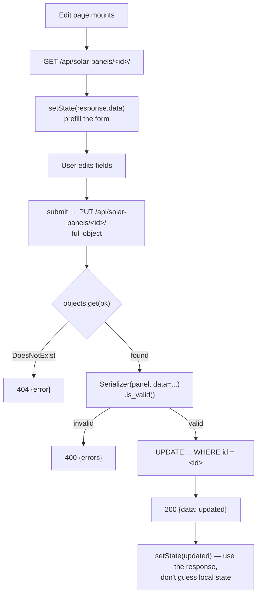
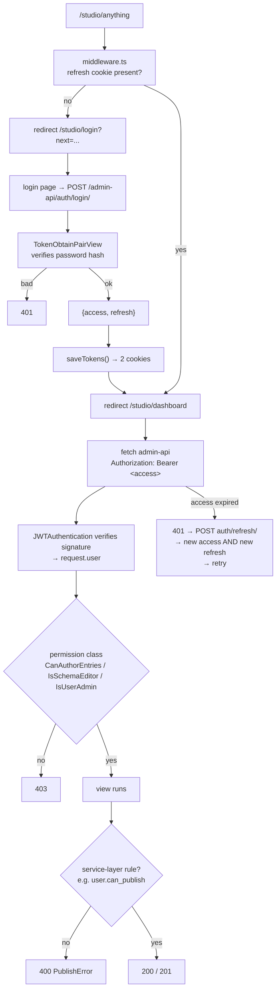
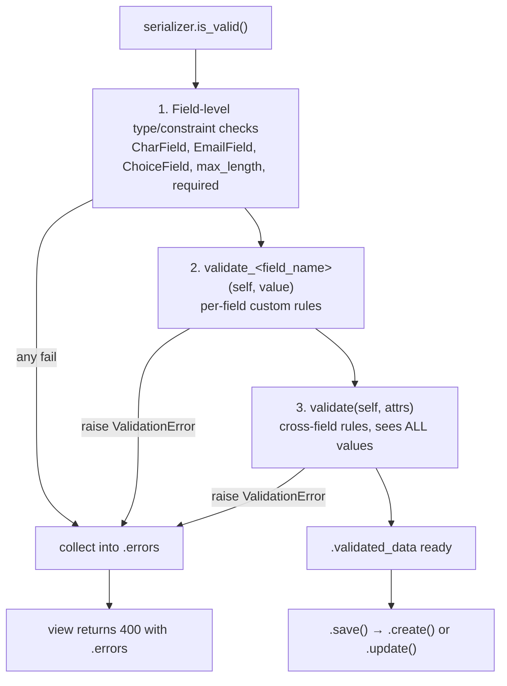
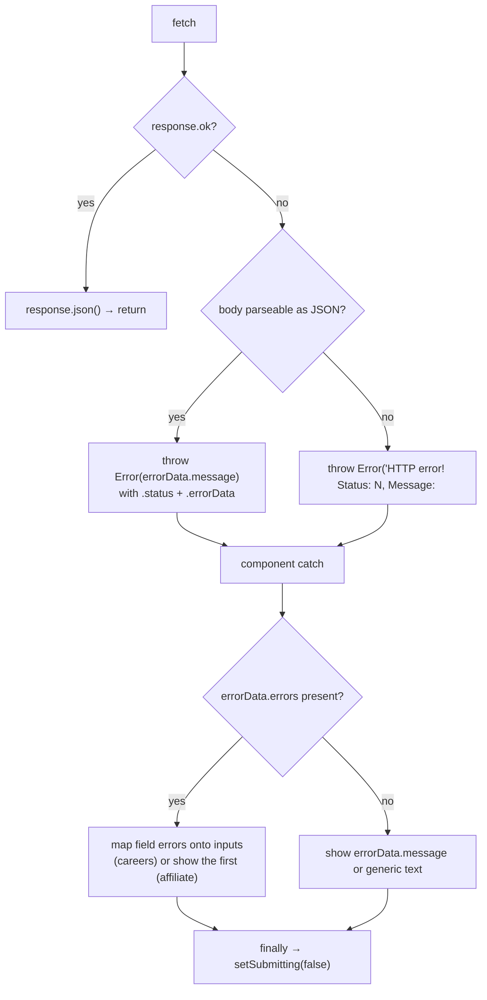

# Backend Learning Guide — Flarize (goldenray)

> Written by reverse-engineering **this** repository. Every claim below points at a real
> file. Where something does not exist here, it is labelled instead of invented.
>
> **Labels used throughout:**
> - **ACTUAL PROJECT** — this exists in the repo, at the path given.
> - **GENERAL CONCEPT** — background knowledge, not implemented here.
> - **NOT IN REPO** — I looked; it isn't there.

---

## Table of contents

1. [Your current situation](#1-your-current-situation)
2. [Project architecture](#2-project-architecture)
3. [Backend folder structure](#3-backend-folder-structure)
4. [How this application works](#4-how-this-application-works)
5. [Request/response lifecycle](#5-requestresponse-lifecycle)
6. [Walkthrough #1 — Affiliate application (POST, JSON)](#6-walkthrough-1--affiliate-application-post-json)
7. [Walkthrough #2 — Job application (POST, file upload)](#7-walkthrough-2--job-application-post-file-upload)
8. [Walkthrough #3 — Blog listing (GET, cross-service, caching)](#8-walkthrough-3--blog-listing-get-cross-service-caching)
9. [Backend concepts explained through this project](#9-backend-concepts-explained-through-this-project)
10. [How to add a completely new form](#10-how-to-add-a-completely-new-form)
11. [How to add a field to an existing form](#11-how-to-add-a-field-to-an-existing-form)
12. [How to add a new API endpoint](#12-how-to-add-a-new-api-endpoint)
13. [How to update existing data](#13-how-to-update-existing-data)
14. [How to delete data](#14-how-to-delete-data)
15. [Authentication & authorization](#15-authentication--authorization)
16. [Validation](#16-validation)
17. [Database operations](#17-database-operations)
18. [Error handling](#18-error-handling)
19. [Backend debugging](#19-backend-debugging)
20. [How to read backend code](#20-how-to-read-backend-code)
21. [Feature development playbook](#21-feature-development-playbook)
22. [Requirement → implementation framework](#22-requirement--implementation-framework)
23. [Learn now vs learn later](#23-learn-now-vs-learn-later)
24. [Backend vocabulary](#24-backend-vocabulary)
25. [Practical exercises](#25-practical-exercises)
26. [Quick reference](#26-quick-reference)

---

## 1. Your current situation

You already know the hardest half of what this repo does. `frontend/src` is 250+ TypeScript
files of Next.js App Router code — that's your home turf. What you're missing is a mental
model for the ~250 Python files in `goldenray-backend/`.

Here is the single most useful thing to internalise before anything else:

**The backend in this project is mostly a thin translator between HTTP and SQL.**

A browser sends `POST /api/affiliate-applications/` with a JSON body. Django looks up the
URL in a list, calls a Python method, that method hands the JSON to a *serializer* which
checks it field by field, and if it passes, one line (`serializer.save()`) turns it into an
`INSERT INTO affiliate_application ...`. Then it sends JSON back. That's it. That's the
whole shape of 90% of this backend.

Everything else — permissions, throttling, migrations, CORS — is machinery bolted around
that core loop to stop it being abused or breaking.

**One structural fact you must know up front:** this repo contains **two separate Django
backends**, plus some backend code living inside the Next.js app. They do not share a
database, a settings file, or an auth system. Confusing them is the #1 way to waste an
afternoon. Section 2 lays them out.

---

## 2. Project architecture

### 2.1 The three-and-a-half backends

| # | What | Where | Serves | DB | Port (docker) |
|---|------|-------|--------|----|---------------|
| 1 | **Main Django API** | `goldenray-backend/backend/` (project `backend`, app `goldenray`) | Solar calculators, leads, forms, catalog data | Postgres `GoldenApp` | host `8012` → 8000 |
| 2 | **BOM tool** | `goldenray-backend/backend/bom/` | Internal bill-of-materials pricing tool — *server-rendered HTML*, not an API for the frontend | same Postgres `GoldenApp` | same service as #1 |
| 3 | **Blog CMS** | `goldenray-backend/backend/cms/` (project `config`) | Blog content authoring + public delivery | Postgres `blog_cms` | host `8009` → 8000 |
| 3½ | **Next.js route handlers** | `frontend/src/app/api/`, `frontend/src/app/fe-api/` | Revalidation webhook; PDF rendering with Chrome | none | inside frontend |

**ACTUAL PROJECT** — [docker-compose.yml](docker-compose.yml) wires all of these:

```yaml
services:
  db:        # postgres:16-alpine, one container, two databases
  backend:   # ./goldenray-backend/backend        → gunicorn backend.wsgi
  cms:       # ./goldenray-backend/backend/cms    → gunicorn config.wsgi
  frontend:  # ./frontend                         → next start
```

Note `backend` and `cms` run **different WSGI applications** (`backend.wsgi` vs
`config.wsgi`). They are genuinely separate Django projects that happen to live in nested
folders. `cms` is not an app inside `backend`.

### 2.2 How the browser reaches each one

**Important and slightly unusual:** the frontend does **not** proxy API calls through
Next.js. The browser talks to Django **directly**, cross-origin. That's why CORS matters
here (see §15.5).

**ACTUAL PROJECT** — [frontend/src/config.ts](frontend/src/config.ts):

```ts
export const API_BASE_URL       = process.env.NEXT_PUBLIC_API_BASE_URL       || defaultApiBaseUrl;
export const BLOG_API_BASE_URL  = process.env.NEXT_PUBLIC_BLOG_API_BASE_URL  || defaultBlogApiBaseUrl;
export const ADMIN_API_BASE_URL = process.env.NEXT_PUBLIC_ADMIN_API_BASE_URL || defaultAdminApiBaseUrl;
```

Three base URLs, three different backends:

- `API_BASE_URL` → main Django (`.../api/`) — dev default `http://127.0.0.1:8000/api/`
- `BLOG_API_BASE_URL` → CMS **delivery** API (`.../api`) — public, read-only
- `ADMIN_API_BASE_URL` → CMS **admin** API (`.../admin-api/`) — JWT-protected authoring

The `NEXT_PUBLIC_` prefix means these are **inlined into the browser bundle at build
time**. Changing them requires a rebuild, not a restart. [.env.example](.env.example) says
this explicitly, and it's a real operational gotcha.

### 2.3 Overall architecture diagram



### 2.4 Frontend inventory (so you can see where backend work begins)

| Concern | **ACTUAL PROJECT** location |
|---|---|
| Framework / router | Next.js 15 App Router — `frontend/src/app/` |
| Components | `frontend/src/components/<Feature>/` |
| API clients | `frontend/src/services/*.ts` — **this is the seam between frontend and backend** |
| Low-level fetch | [frontend/src/utils/fetchApi.ts](frontend/src/utils/fetchApi.ts) |
| Base URLs / config | [frontend/src/config.ts](frontend/src/config.ts) |
| Route protection | [frontend/src/middleware.ts](frontend/src/middleware.ts) — gates `/studio/*` |
| Types | `frontend/src/types/*.ts` + interfaces declared inside each service |
| Form state | Plain `useState` in each component. **NOT IN REPO:** react-hook-form, formik, zod, redux, zustand, react-query. |
| Loading / error UI | Local `useState` booleans + strings per form |

There is no global state manager and no data-fetching library. Every form is
`useState` + `try/catch` + `setSubmitting`. That's genuinely all of it — see
[frontend/src/components/AffiliatePrograms/Form.tsx](frontend/src/components/AffiliatePrograms/Form.tsx).

---

## 3. Backend folder structure

### 3.1 Main backend — `goldenray-backend/backend/`

```
manage.py                     ← CLI entry point (runserver, migrate, shell, ...)
backend/                      ← the PROJECT (config, not features)
  settings.py                 ← everything global: DB, apps, middleware, DRF, JWT, CORS
  urls.py                     ← root URL table
  wsgi.py / asgi.py           ← the server entry point gunicorn imports
goldenray/                    ← the APP that serves the public website API
  urls.py                     ← 40+ routes, all under /api/
  views/                      ← one file per resource; request handlers live here
  serializers/                ← validation + JSON shape, one file per resource
  models/                     ← database tables, one file per table
  migrations/                 ← 52 numbered files: the DB's version history
  permissions.py              ← who may call what
  utils/finance.py            ← EMI math helper
  twilio_utils.py             ← SMS/OTP via Twilio
  management/commands/        ← custom `manage.py <name>` scripts (data seeding)
  admin.py                    ← Django admin registrations
bom/                          ← internal BOM tool (templates + its own REST API)
cms/                          ← a WHOLE SEPARATE DJANGO PROJECT (see 3.2)
```

**Read this next bit carefully, it's the key to navigating the app:**

`goldenray/models.py`, `goldenray/views.py` and `goldenray/tests.py` are 3-line stubs left
over from `startapp`. The real code is in the **directories** `models/`, `views/`,
`serializers/`. Python resolves `goldenray.models` to the package `models/` (which has an
`__init__.py`), not the file. Don't be fooled by the stubs.

`models/__init__.py` re-exports every model so `from ..models import SolarPanel` works:

```python
from .battery import Battery
from .device_type import DeviceType
...
from .job_application import JobApplication
```

**Naming convention, consistent across the app:** for a resource `Foo` you get
`models/foo.py` → `serializers/foo_serializer.py` → `views/foo_views.py`. Follow it.

### 3.2 CMS backend — `goldenray-backend/backend/cms/`

```
manage.py
config/                       ← the project (settings.py, urls.py, wsgi.py)
accounts/                     ← custom user model (AdminUser), roles, JWT login
catalog/                      ← Collections, Templates, Categories, Tags, Authors
content/                      ← Entry (a blog post) + the publish workflow
  models.py                   ← Entry, ContentBlock, EntryImage, ...
  selectors.py                ← READ queries live here
  services.py                 ← WRITE business logic lives here
  serializers.py              ← List / Read / Write serializers
  views.py                    ← EntryViewSet (thin)
  signals.py                  ← reacts to save/delete
  revalidation.py             ← pings the Next.js frontend
delivery/                     ← public read-only API, Strapi-shaped
media/                        ← MediaAsset + BunnyCDN upload pipeline
```

**This is architecturally different from the main backend and it matters for learning.**
The CMS has a real layered structure with a documented convention. From
[cms/content/services.py](goldenray-backend/backend/cms/content/services.py):

```python
"""Write-side business logic for entries: publish workflow + validation.

Views stay thin; all state transitions live here (team convention).
"""
```

and [cms/content/selectors.py](goldenray-backend/backend/cms/content/selectors.py):

```python
"""Read-side query builders (team convention: selectors hold ORM reads)."""
```

The main `goldenray` app has **no service layer**. Business logic sits directly inside the
view methods. When you add to `goldenray`, follow `goldenray`'s convention; when you add to
the CMS, follow the CMS's. Section 21 covers when to introduce a service layer anyway.

---

## 4. How this application works

### 4.1 The four moving parts of the main API

Read these definitions with the analogy, then read the real file.

**Route (URL pattern)**
- *What it is:* a table mapping a URL path to a Python class.
- *Frontend analogy:* your `app/` directory in Next.js — the filesystem is the routing
  table. In Django you write the table by hand.
- *Where:* [goldenray/urls.py](goldenray-backend/backend/goldenray/urls.py)

```python
path("affiliate-applications/", AffiliateApplicationAPIView.as_view(), name="affiliate-application-create"),
```

Combined with the root table in [backend/urls.py](goldenray-backend/backend/backend/urls.py):

```python
path("api/", include("goldenray.urls")),
```

the full path becomes `/api/affiliate-applications/`. **The trailing slash is part of the
URL.** Django will not match without it. Every service in `frontend/src/services` keeps it.

*If removed:* the URL 404s. Nothing else notices.

**View (the request handler)**
- *What it is:* a class with `get`/`post`/`put`/`delete` methods. DRF picks the method
  matching the HTTP verb.
- *Frontend analogy:* a Next.js route handler's `export async function POST(req)` — same
  idea, method name = HTTP verb.
- *Where:* `goldenray/views/*.py`

*If removed:* the URL import fails and the **entire Django process refuses to boot** —
`urls.py` imports every view at startup. A typo in one view file breaks all 40 endpoints.
That's a real failure mode you will hit.

**Serializer (validation + shape)**
- *What it is:* declares which fields exist, their types and rules; converts JSON ⇄ model
  instance. Both directions.
- *Frontend analogy:* a zod schema *and* a DTO mapper in one object. It is the closest
  thing this backend has to a typed contract.
- *Where:* `goldenray/serializers/*.py`

*If removed:* no validation. Garbage goes into the database, or the ORM throws a 500 on
malformed input instead of returning a clean 400.

**Model (the table)**
- *What it is:* a Python class where each attribute is a database column. Django generates
  SQL from it.
- *Frontend analogy:* a TypeScript `interface`, except this one actually creates the
  storage and enforces types at write time.
- *Where:* `goldenray/models/*.py`

*If removed:* nothing can be stored or read. Migrations that reference it break.

### 4.2 Two request styles in the main API



**Style A — serializer-driven persistence.** Used by every form endpoint.
Examples: `affiliate_application_views.py`, `job_application_views.py`,
`warranty_service_request_views.py`, `lead_collection_home_views.py`, `solar_panel_views.py`.

**Style B — hand-rolled computation.** Used by the calculators. No serializer at all;
the view reads `request.data.get(...)`, validates with `if` statements, queries the ORM,
does arithmetic, returns a dict. See
[views/solar_calculator_new_views.py](goldenray-backend/backend/goldenray/views/solar_calculator_new_views.py):

```python
monthly_bill = request.data.get("monthly_bill")
pincode      = request.data.get("pincode")
property_type = request.data.get("property_type")

if not all([monthly_bill, pincode, property_type]):
    return Response({"error": "Missing required fields"}, status=status.HTTP_400_BAD_REQUEST)
```

Style B is what most of the calculator code looks like. It works, but it's why the
calculator endpoints have inconsistent error shapes (§18.2). **When you write a new
endpoint that stores data, use Style A.**

### 4.3 Response envelope — there is no single convention

This is a real inconsistency in the repo and you need to know it, because your frontend
code has to match whichever endpoint you're calling:

| Endpoint | Success body | File |
|---|---|---|
| `POST /api/affiliate-applications/` | `{message, status, data}` | `affiliate_application_views.py` |
| `POST /api/job-applications/` | `{message, status, data}` | `job_application_views.py` |
| `POST /api/warranty-service-requests/` | `{message, status, data}` | `warranty_service_request_views.py` |
| `GET /api/solar-panels/` | `{data, meta:{total}}` | `solar_panel_views.py` |
| `GET/POST /api/lead-collection-home/` | bare `serializer.data` | `lead_collection_home_views.py` |
| `GET /api/customer-installations/` | bare `serializer.data` | `customer_installation_views.py` |
| `POST /api/calculate-solar-new/` | flat computed dict | `solar_calculator_new_views.py` |
| CMS `GET /api/articles` | `{data, meta:{pagination}}` (Strapi-shaped) | `cms/delivery/views.py` |
| CMS `GET /admin-api/entries/` | `{count, next, previous, results}` (DRF paging) | DRF default |

**The newest code — the three public form endpoints — uses `{message, status, data|errors}`.
That is the convention to follow for new form endpoints.** It's the one the frontend error
handling in [fetchApi.ts](frontend/src/utils/fetchApi.ts) is built around (it reads
`errorData.message`).

---

## 5. Request/response lifecycle

The **actual** path a form submission takes in this project:

```
┌─ BROWSER ────────────────────────────────────────────────────────────┐
│ 1. React component, "use client"                                     │
│    frontend/src/components/<Feature>/<Form>.tsx                      │
│    <form onSubmit={handleSubmit}>                                    │
│ 2. handleSubmit(): e.preventDefault() → validate() → setSubmitting   │
│ 3. Calls a service function                                          │
│    frontend/src/services/<feature>Service.ts                         │
│ 4. Service calls apiCall() → fetchApi()                              │
│    frontend/src/utils/fetchApi.ts  (JSON only)                       │
│    …or does its own fetch() when uploading files (FormData)          │
│ 5. fetch(`${API_BASE_URL}<endpoint>`, {method, headers, body})       │
└──────────────────────────┬───────────────────────────────────────────┘
                           │ HTTP, cross-origin
┌─ DJANGO (main) ──────────▼───────────────────────────────────────────┐
│ 6.  MIDDLEWARE chain (settings.py MIDDLEWARE, top to bottom):        │
│       Security → Session → CORS → Common → CSRF → Auth → Messages    │
│ 7.  URL resolution: backend/urls.py  →  goldenray/urls.py            │
│ 8.  DRF wraps the request; JWTAuthentication reads Authorization:    │
│     Bearer <token> if present (sets request.user, else AnonymousUser)│
│ 9.  Permission check: ApiMethodPermission.has_permission()           │
│ 10. Throttle check: ScopedRateThrottle (only on the 3 form views)    │
│ 11. Parser turns the body into request.data                          │
│       JSONParser (default) or MultiPartParser (uploads)              │
│ 12. View method runs: .post(self, request)                           │
│ 13. Serializer(data=request.data).is_valid()                         │
│       → field types → validate_<field>() → validate()                │
│ 14. serializer.save() → Django ORM → SQL INSERT → PostgreSQL         │
│ 15. Response({...}, status=201) → rendered to JSON                   │
│ 16. CORS middleware adds Access-Control-Allow-Origin on the way out  │
└──────────────────────────┬───────────────────────────────────────────┘
                           │ HTTP response
┌─ BROWSER ────────────────▼───────────────────────────────────────────┐
│ 17. fetchApi: response.ok? → .json() : throw Error with .status      │
│                                            and .errorData attached   │
│ 18. Component catch block reads err.errorData.errors                 │
│ 19. setErrorMessage(...) / setSuccessMessage(...) / setSubmitted(true)│
│ 20. React re-renders; setSubmitting(false) in finally                │
└──────────────────────────────────────────────────────────────────────┘
```

Steps 6–11 are **framework machinery you don't write** — but they're where "my request
never reached my code" bugs live. Sections 18 and 19 make that concrete.

---

## 6. Walkthrough #1 — Affiliate application (POST, JSON)

The cleanest end-to-end example in the repo. Learn this one properly and the other forms
are re-reads.

### 6.1 The 16-point trace

**1. Frontend file that starts it**
[frontend/src/components/AffiliatePrograms/Form.tsx](frontend/src/components/AffiliatePrograms/Form.tsx)
— rendered by `frontend/src/app/affiliate-programs/page.tsx` via `AffiliateMainPage.tsx`.

**2. Function triggered** — `handleSubmit` (line ~81):

```tsx
const handleSubmit = async (e: React.FormEvent<HTMLFormElement>) => {
  e.preventDefault();
  const validationError = validate();          // client-side gate
  if (validationError) { setErrorMessage(validationError); return; }
  setSubmitting(true);                          // loading state
  try {
    const payload: AffiliateApplicationData = {
      full_name: formData.full_name.trim(),
      phone: normalizePhone(formData.phone),    // strips +91, spaces, dashes
      email: formData.email.trim().toLowerCase(),
      profession: formData.profession,
      district: formData.district,
      website: formData.website,                // honeypot, always ""
    };
    const res = await submitAffiliateApplication(payload);
    ...
```

Note: **the payload keys are `snake_case`.** They match the Django model field names
exactly. There is no camelCase↔snake_case mapping layer anywhere in this project — the
frontend just speaks the backend's naming. Keep doing that.

**3. HTTP method** — `POST`.

**4. URL** — `${API_BASE_URL}affiliate-applications/`
→ `https://flarize.com/api/affiliate-applications/` in prod,
`http://127.0.0.1:8000/api/affiliate-applications/` in dev.

**5. Request body** —

```json
{"full_name":"Asha K","phone":"9876543210","email":"asha@example.com",
 "profession":"Real Estate Agent","district":"Ernakulam","website":""}
```

**6. Headers** — `Content-Type: application/json`, set in
[fetchApi.ts](frontend/src/utils/fetchApi.ts). Nothing else.

**7. Authentication sent** — **none.** No token, no cookie
(`credentials: "include"` is commented out in `fetchApi.ts`). This is a public endpoint.

**8. Backend route** —
[goldenray/urls.py](goldenray-backend/backend/goldenray/urls.py):

```python
path("affiliate-applications/", AffiliateApplicationAPIView.as_view(), name="affiliate-application-create"),
```

**9. View / handler** —
[goldenray/views/affiliate_application_views.py](goldenray-backend/backend/goldenray/views/affiliate_application_views.py):

```python
class AffiliateApplicationAPIView(APIView):
    permission_classes = [ApiMethodPermission]      # ← who may call
    throttle_classes = [ScopedRateThrottle]         # ← rate limiting on
    throttle_scope = "affiliate_application"        # ← looks up "5/min" in settings

    @non_authenticated_view                         # ← marks POST as public
    def post(self, request):
        serializer = AffiliateApplicationSerializer(data=request.data)
        if serializer.is_valid():
            serializer.save()
            return Response({"message": "Message sent!", "status": "success",
                             "data": serializer.data}, status=status.HTTP_201_CREATED)
        return Response({"message": "Validation failed", "status": "error",
                         "errors": serializer.errors}, status=status.HTTP_400_BAD_REQUEST)
```

Line by line:
- `permission_classes = [ApiMethodPermission]` overrides the global default
  (`IsAuthenticated`) with the project's custom per-method rule.
- `throttle_scope = "affiliate_application"` matches the key in
  `settings.REST_FRAMEWORK["DEFAULT_THROTTLE_RATES"]` → `"5/min"`. Six posts from the same
  IP in a minute → **429**, before your code runs.
- `@non_authenticated_view` sets `_non_authenticated_view = True` on the function, which
  `ApiMethodPermission` reads. This is *how a single endpoint opts out of auth*. **Without
  it this endpoint returns 401 to every visitor.**
- `serializer.is_valid()` runs all validation and populates `.errors` or `.validated_data`.
- `serializer.save()` → because no instance was passed to the constructor, DRF calls
  `.create()` → `AffiliateApplication.objects.create(**validated_data)` → SQL INSERT.
- `serializer.data` is the saved row re-serialized (now includes `id` and `created_at`,
  and excludes `website` because it's `write_only`).

**10. Service / business logic** — **none.** There is no service layer in this app. The
view *is* the logic. (**GENERAL CONCEPT:** in bigger systems you'd extract to a service;
the CMS half of this repo does exactly that — see `cms/content/services.py`.)

**11. Validation** —
[serializers/affiliate_application_serializer.py](goldenray-backend/backend/goldenray/serializers/affiliate_application_serializer.py).
Full detail in §16.

**12. Database operation** — `INSERT INTO affiliate_application (full_name, phone, email,
profession, district, created_at) VALUES (...)`. Table name is pinned by
`class Meta: db_table = "affiliate_application"` in the model.

**13. Response** — `201 Created`:

```json
{"message":"Message sent!","status":"success",
 "data":{"id":42,"full_name":"Asha K","phone":"9876543210","email":"asha@example.com",
         "profession":"Real Estate Agent","district":"Ernakulam",
         "created_at":"2026-08-15T10:22:31.123456+05:30"}}
```

**14. Error handling** — validation failure → `400` with
`{"message":"Validation failed","status":"error","errors":{"phone":["Enter a valid 10-digit Indian mobile number."]}}`.
`errors` is keyed by field name, each value an array of strings. **That shape is DRF's, and
the frontend depends on it.**

**15. Frontend processing** —
[fetchApi.ts](frontend/src/utils/fetchApi.ts) turns any non-2xx into a thrown `Error`
carrying `.status` and `.errorData`:

```ts
const error = new Error(errorData.message || `HTTP error! Status: ${response.status}`) as Error & {
  status: number; errorData: typeof errorData;
};
error.status = response.status;
error.errorData = errorData;
throw error;
```

The component then digs the first field error out:

```tsx
const fieldErrors = apiError?.errorData?.errors;
if (fieldErrors) {
  const firstKey = Object.keys(fieldErrors)[0];
  setErrorMessage(fieldErrors[firstKey]?.[0] || "Submission failed. Please try again.");
}
```

**16. UI change** — success: green `role="status"` message + `setFormData(INITIAL_STATE)`.
Failure: red `role="alert"` message. Either way `finally { setSubmitting(false) }` re-enables
the button (`{submitting ? "Submitting..." : "Submit Application"}`).

### 6.2 Diagram



---

## 7. Walkthrough #2 — Job application (POST, file upload)

Same skeleton, but files change three things: the frontend can't use the shared helper, the
backend needs a different parser, and the data lands on disk instead of only in the DB.

### 7.1 What's different, and why

**Frontend bypasses `fetchApi`.**
[frontend/src/services/careerApplicationService.ts](frontend/src/services/careerApplicationService.ts)
says it outright:

```ts
// This endpoint uploads files, so it must be sent as multipart/form-data.
// The shared `apiCall` / `fetchApi` helper sends JSON only, so we post the
// FormData directly here. We do NOT set Content-Type — the browser adds the
// multipart boundary automatically.
```

```ts
const fd = new FormData();
fd.append("full_name", data.full_name);
...
fd.append("declaration_accepted", String(data.declaration_accepted));  // note: String()
fd.append("resume", data.resume);                                     // the File object
if (data.portfolio_file) fd.append("portfolio_file", data.portfolio_file);

const response = await fetch(`${API_BASE_URL}job-applications/`, { method: "POST", body: fd });
```

**Two things a beginner gets wrong here, both visible in this code:**
1. **Never set `Content-Type` manually for FormData.** The boundary string is generated by
   the browser; hardcoding `multipart/form-data` produces a body Django can't parse and you
   get a confusing 400.
2. **Everything in FormData is a string.** `declaration_accepted` becomes `"true"`. DRF's
   `BooleanField` knows how to coerce `"true"`, but if you'd sent `String(false)` →
   `"false"`, it coerces to `False` and the serializer rejects it — which is the intended
   behaviour here.

**Backend declares a parser.**
[views/job_application_views.py](goldenray-backend/backend/goldenray/views/job_application_views.py):

```python
# The form carries file uploads (resume / portfolio), so accept multipart.
parser_classes = [MultiPartParser, FormParser]
```

Without this line DRF only accepts JSON and returns **415 Unsupported Media Type**. This is
the single most common "why is my upload failing" cause.

**Model stores a path, not bytes.**
[models/job_application.py](goldenray-backend/backend/goldenray/models/job_application.py):

```python
def resume_upload_path(instance, filename):
    return f"job_applications/resumes/{filename}"

resume = models.FileField(upload_to=resume_upload_path)
```

`FileField` writes the file under `MEDIA_ROOT` and stores the **relative path string** in a
`varchar` column. From [backend/settings.py](goldenray-backend/backend/backend/settings.py):

```python
MEDIA_URL = "/media/"
MEDIA_ROOT = os.path.join(BASE_DIR, "media")
```

so the file lands at `goldenray-backend/backend/media/job_applications/resumes/<filename>`.
[backend/urls.py](goldenray-backend/backend/backend/urls.py) serves it back **in DEBUG only**:

```python
if settings.DEBUG:
    urlpatterns += static(settings.MEDIA_URL, document_root=settings.MEDIA_ROOT)
```

**Known limitation, worth understanding:** `upload_to` uses the raw filename, so two
candidates named `resume.pdf` collide — Django resolves it by suffixing (`resume_XYZ.pdf`),
but the paths are guessable and files are not deduplicated. Also, `docker-compose.yml`
defines a volume for `cms_uploads` but **not** for the main backend's `media/` — so in
Docker, uploaded resumes live in the container's writable layer and are lost on
`docker compose down`. That's a real bug you could fix as an exercise.

**File validation is in the serializer**
([serializers/job_application_serializer.py](goldenray-backend/backend/goldenray/serializers/job_application_serializer.py)):

```python
MAX_FILE_BYTES = 10 * 1024 * 1024  # 10 MB
ALLOWED_FILE_EXTENSIONS = (".pdf", ".doc", ".docx")

def _validate_upload(uploaded_file):
    name = (uploaded_file.name or "").lower()
    _, ext = os.path.splitext(name)
    if ext not in ALLOWED_FILE_EXTENSIONS:
        raise serializers.ValidationError("Only PDF or Word documents are allowed.")
    if uploaded_file.size > MAX_FILE_BYTES:
        raise serializers.ValidationError("File must be under 10MB.")
    return uploaded_file
```

Note the comment above it: *"Keep in sync with the frontend Careers form (Max 10MB, PDF /
Word)"*. This is the duplication tax — the same rule exists in
`components/Career/ApplicationForm.tsx` as `validateFile`. **Both must exist**: the client
copy for fast feedback, the server copy because the client can be bypassed.

### 7.2 Error mapping — the better pattern

`ApplicationForm.tsx` maps *all* server field errors back onto individual inputs, rather
than showing only the first (which is what the affiliate form does):

```tsx
const fieldErrors = apiError?.errorData?.errors;
if (fieldErrors) {
  const mapped: Record<string, string> = {};
  for (const [key, msgs] of Object.entries(fieldErrors)) {
    if (Array.isArray(msgs) && msgs[0]) mapped[key] = msgs[0];
  }
  setErrors(mapped);
  focusFirstError(mapped);
}
```

This works because **the serializer field names and the form state keys are identical**.
Copy this pattern for new forms.

---

## 8. Walkthrough #3 — Blog listing (GET, cross-service, caching)

This one crosses a service boundary and shows caching + a webhook. It's the most
"architectural" flow in the repo.

### 8.1 The read path

**1. Page** — [frontend/src/app/blog/page.tsx](frontend/src/app/blog/page.tsx). A **server
component** (`export default async function BlogPage()`), so this `fetch` happens on the
Next.js server, not in the browser:

```tsx
export const revalidate = 120;                       // ISR: rebuild at most every 2 min
export default async function BlogPage() {
  const { articles, categories } = await fetchAllArticles();
```

**2. Service** — [frontend/src/services/blogApiService.ts](frontend/src/services/blogApiService.ts),
hitting `BLOG_API_BASE_URL` (the **CMS**, not the main backend), with a matching cache
window and a comment explaining exactly why the two numbers must agree:

```ts
// Keep this EQUAL to the `revalidate = 120` on the blog pages: Next collapses a
// segment's revalidate to the minimum of the route export and every fetch window
// inside it...
const REVALIDATE_SECONDS = 120;
```

**3. CMS route** — [cms/config/urls.py](goldenray-backend/backend/cms/config/urls.py):

```python
path("api/", include("delivery.urls")),
```

→ [cms/delivery/urls.py](goldenray-backend/backend/cms/delivery/urls.py):

```python
path("<slug:api_uid>", CollectionDeliveryView.as_view(), name="delivery-collection"),
```

A **single dynamic route serves every collection**. `/api/articles` sets `api_uid="articles"`.
That's a design worth noticing: the collections are rows in a table, not hardcoded routes.

**4. View** — [cms/delivery/views.py](goldenray-backend/backend/cms/delivery/views.py):

```python
class CollectionDeliveryView(APIView):
    permission_classes = [AllowAny]
    authentication_classes = []      # public endpoint, no auth attempted

    def get(self, request, api_uid: str):
        if not Collection.objects.filter(api_uid=api_uid, is_active=True).exists():
            raise Http404(f"Unknown collection '{api_uid}'")
        qs = published_entries(api_uid)            # ← selector, not inline ORM
        filters, excludes = parse_filters(request.query_params)
        ...
        resp["Cache-Control"] = "public, max-age=60, stale-while-revalidate=600"
```

`authentication_classes = []` is deliberate: it stops DRF even *attempting* JWT parsing on a
public endpoint, so a stale token in a header can't cause a 401 on public content.

**5. Selector** — [cms/content/selectors.py](goldenray-backend/backend/cms/content/selectors.py):

```python
def published_entries(collection_uid: str):
    return _base_queryset().filter(
        collection__api_uid=collection_uid,
        collection__is_active=True,
        status=Entry.Status.PUBLISHED,
    )
```

**This is the security boundary for the blog.** Drafts never leave the CMS because this one
function filters `status=PUBLISHED`. Delete that filter and unpublished posts go live. That
is exactly why the read logic is centralised in a selector instead of being copy-pasted into
views.

`_base_queryset()` uses `select_related` / `prefetch_related` — see §17.4 on why.

**6. Query parsing** — [cms/delivery/query.py](goldenray-backend/backend/cms/delivery/query.py)
translates Strapi-style params (`filters[slug][$eq]=x`, `pagination[pageSize]=100`) into ORM
kwargs. Crucially it uses a **whitelist**:

```python
FIELD_MAP = {"slug": "slug", "title": "title", "documentId": "document_id", ...}
OP_MAP    = {"$eq": "exact", "$in": "in", "$contains": "icontains", ...}
```

```python
field = FIELD_MAP.get(m.group("field"))
if field is None or op not in OP_MAP:
    continue                                  # unknown param → silently ignored
```

Without that whitelist, a client could filter on `created_by__password` or any related
field — a genuine data-leak class of bug. **Whitelist anything that turns user input into an
ORM lookup.** Compare with `solar_panel_views.py`, which builds filters from `request.GET`
directly but only ever assigns to fixed, named lookups — also safe, for the same reason.

### 8.2 Freshness: ISR + webhook



Two independent mechanisms, and the second is a fallback for the first:
- **Push:** the CMS pings the frontend on publish → page refreshes in seconds.
- **Pull:** `revalidate = 120` → even if the ping fails, the page is at most 2 min stale.

[cms/content/revalidation.py](goldenray-backend/backend/cms/content/revalidation.py)
deliberately swallows failures — *"Failures are swallowed (best-effort) — the API is always
live regardless."* A CMS publish must not fail because the frontend is down. That's a
design decision worth copying: **best-effort side effects should never break the primary
operation.**

[cms/content/signals.py](goldenray-backend/backend/cms/content/signals.py) covers the
Django-admin path, which bypasses the service layer entirely:

```python
@receiver(post_save, sender=Entry)
def entry_saved(sender, instance, created, **kwargs):
    if instance.status == Entry.Status.PUBLISHED:
        trigger_revalidate(instance.slug)
```

**GENERAL CONCEPT — signals:** a publish/subscribe hook on ORM events. Useful for
cross-cutting side effects; dangerous as primary business logic because they fire
invisibly from anywhere (including `manage.py shell` and bulk scripts). The repo uses them
correctly here: as a safety net for a code path the service layer can't see.

---

## 9. Backend concepts explained through this project

Each concept: what · why · where · code · what breaks.

### 9.1 Entry point

**What:** the file the web server imports to get an application object.
**Why:** something must bootstrap Django before any of your code exists.
**Where:** [goldenray-backend/backend/backend/wsgi.py](goldenray-backend/backend/backend/wsgi.py),
run by `gunicorn backend.wsgi:application` in `docker-compose.yml`. In dev you run
`python manage.py runserver`, which does the equivalent.
**If removed:** the container won't start. Nothing at all responds.

### 9.2 Settings

**What:** one module of module-level constants Django reads at boot.
**Why:** central place for everything environment-dependent.
**Where:** [backend/settings.py](goldenray-backend/backend/backend/settings.py).

```python
load_dotenv()                                        # reads .env into os.environ
ENVIRONMENT = os.getenv("DJANGO_ENV", "development")
DEBUG = ENVIRONMENT != "production"
```

Everything downstream keys off `ENVIRONMENT`: `DEBUG`, CORS policy, HTTPS redirect, cookie
security, JWT lifetime, log level. **One variable flips the whole security posture.** In
dev, `CORS_ALLOW_ALL_ORIGINS = True`; in prod, an explicit allowlist. This is the closest
backend equivalent to `process.env.NODE_ENV` in your Next.js code.

**If removed:** nothing boots.

### 9.3 Middleware

**What:** a stack of wrappers around every request/response, in order.
**Why:** cross-cutting concerns that shouldn't be repeated per view.
**Frontend analogy:** Next.js `middleware.ts` — and this repo has one of those too, so you
can compare directly.

```python
MIDDLEWARE = [
    "django.middleware.security.SecurityMiddleware",
    "django.contrib.sessions.middleware.SessionMiddleware",
    "corsheaders.middleware.CorsMiddleware",        # ← must be high in the list
    "django.middleware.common.CommonMiddleware",
    "django.middleware.csrf.CsrfViewMiddleware",
    "django.contrib.auth.middleware.AuthenticationMiddleware",
    ...
]
```

Requests flow **down** the list, responses flow back **up**. `CorsMiddleware` sits above
`CommonMiddleware` on purpose — it must add its headers even to responses that
`CommonMiddleware` short-circuits (like redirects), otherwise the browser reports a CORS
error on a response that never had a chance to reach your view.

**If `CorsMiddleware` were removed:** every browser call from the Next.js app fails with a
CORS error, while `curl` works perfectly. That asymmetry is the tell (§19.10).

**NOT IN REPO:** custom middleware. Both projects use only third-party/Django middleware.

### 9.4 URL configuration (routing)

Covered in §4.1. One more thing worth knowing: the `name=` argument.

```python
path("batteries/<int:pk>/", BatteryAPIView.as_view(), name="battery-retrieve-update-destroy"),
```

`<int:pk>` is a **path converter**: it matches digits, converts to `int`, and passes it as
the keyword argument `pk` to the view method (`def get(self, request, pk=None)`).
`name=` lets Django code do reverse lookups (`reverse("bom:dashboard")`), which the `bom`
app uses for redirects. The public API doesn't use reverse lookups, but keep naming
consistent anyway.

### 9.5 View

Covered in §4.1. The pattern in this repo: **one `APIView` subclass serves both the
collection and the item**, distinguished by whether `pk` is passed.
[views/solar_panel_views.py](goldenray-backend/backend/goldenray/views/solar_panel_views.py):

```python
def get(self, request, pk=None):
    if pk:
        ... # single item
    panels = SolarPanel.objects.all()
    ... # list, with filters
```

Two URL patterns point at the same class:

```python
path("solar-panels/",            SolarPanelAPIView.as_view(), name="solar-panel-list-create"),
path("solar-panels/<int:pk>/",   SolarPanelAPIView.as_view(), name="solar-panel-retrieve-update-destroy"),
```

The CMS instead uses DRF `ModelViewSet` + a router
([cms/content/urls.py](goldenray-backend/backend/cms/content/urls.py)), which generates
list/retrieve/create/update/destroy routes automatically. **Two valid styles; match the app
you're editing.**

### 9.6 Serializer

**What:** validation rules + JSON⇄object conversion + which fields are exposed.
**Why:** it's the contract. Never trust `request.data`; the serializer is where untrusted
input becomes trusted `validated_data`.
**Where:** `goldenray/serializers/*.py`.

`ModelSerializer` derives fields from the model, so the minimum viable serializer is tiny
([lead_collection_home_serializer.py](goldenray-backend/backend/goldenray/serializers/lead_collection_home_serializer.py)):

```python
class LeadCollectionHomeSerializer(serializers.ModelSerializer):
    class Meta:
        model = LeadCollectionHome
        fields = ['id', 'name', 'phone_number', 'created_at', 'updated_at']
        read_only_fields = ['id', 'created_at', 'updated_at']
```

- `fields` — the allowlist. A field **not** listed is neither accepted on input nor
  returned on output. Forgetting to add a field here is the #1 cause of "I added the column
  but the value never saves" (§11).
- `read_only_fields` — output only. Prevents a client from POSTing its own `id` or
  back-dating `created_at`.

**If removed:** the view would have to hand-validate every field. See
`solar_calculator_new_views.py` for what that looks like — it's why those endpoints have
ad-hoc error shapes.

### 9.7 Model

**What:** one class ⇄ one table.
**Where:** `goldenray/models/*.py`.

```python
class AffiliateApplication(models.Model):
    full_name  = models.CharField(max_length=255)
    phone      = models.CharField(max_length=20, db_index=True)
    email      = models.EmailField(max_length=254, db_index=True)
    profession = models.CharField(max_length=64, choices=PROFESSION_CHOICES)
    created_at = models.DateTimeField(auto_now_add=True)

    class Meta:
        db_table = "affiliate_application"
```

- `db_index=True` → `CREATE INDEX`. Present on `phone` and `email` because those are the
  columns you'd search by when a lead calls in.
- `choices=...` → an enum. Enforced by the serializer (`ChoiceField`) and by Django admin;
  in Postgres it is *not* a DB-level constraint, just a `varchar`.
- `auto_now_add=True` → set once on insert. (`auto_now=True`, as on
  `LeadCollectionHome.updated_at`, updates on **every** save.)
- `db_table` → pins the physical table name. Without it Django would name it
  `goldenray_affiliateapplication`. This codebase pins every table name; keep doing it.

`class Meta: ordering = ["-created_at"]` on `JobApplication` means every query returns
newest-first by default, without any `.order_by()` in the view.

**If removed:** nothing works and migrations break.

### 9.8 Migration

**What:** a versioned, ordered script that changes the database schema.
**Why:** the model file describes the *desired* shape; the DB has an *actual* shape.
Migrations are the diff, checked into git so every environment applies the same changes in
the same order.
**Frontend analogy:** there isn't a good one. Closest: a lockfile plus an ordered changelog
that also runs.
**Where:** `goldenray/migrations/` — **52 files**, `0001_initial.py` → `0052_jobapplication.py`.

```python
class Migration(migrations.Migration):
    dependencies = [('goldenray', '0051_warrantyservicerequest')]   # ← the ordering
    operations = [migrations.CreateModel(name='JobApplication', fields=[...])]
```

This project uses **two kinds**:
- **Schema migrations** — auto-generated by `makemigrations`. E.g. `0052_jobapplication.py`.
- **Data migrations** — hand-written, they insert or update *rows*. E.g.
  `0006_insert_kseb_tariffs.py`, `0043_populate_device_type_k_values.py`,
  `0034_set_inverter_price_solarinstallationnew.py`. The tariff tables, pincodes, device
  types and EV specs were all seeded this way. **This is a deliberate convention in this
  repo:** reference data ships in migrations so every environment has it.

There are also `management/commands/` seeders (`seed_catalog.py`, `populate_solar_panels.py`,
`seed_blog.py`) for bulk/optional data — run manually, not automatic.

**Never edit an applied migration.** Add a new one. Editing history desyncs
`django_migrations` (the table that records what's been applied) from reality.

**If removed:** the DB won't have the tables. `docker-compose.yml` runs
`python manage.py migrate --noinput` on every container start, so a missing migration means
a broken deploy.

### 9.9 Permission class

**What:** an object with `has_permission(request, view) -> bool`, checked before the view
method runs.
**Where:** [goldenray/permissions.py](goldenray-backend/backend/goldenray/permissions.py)
and [cms/accounts/permissions.py](goldenray-backend/backend/cms/accounts/permissions.py).
Full analysis in §15.

### 9.10 Throttle

**What:** a request-rate cap.
**Where:** declared on the three newest form views, configured in settings:

```python
"DEFAULT_THROTTLE_RATES": {
    "affiliate_application": "5/min",
    "warranty_service_request": "5/min",
    "job_application": "5/min",
},
```

DRF's `ScopedRateThrottle` keys on client IP for anonymous users and stores counters in the
**Django cache**. **NOT IN REPO:** an explicit `CACHES` setting — so Django's default
`LocMemCache` is used, which is per-process and in-memory. With multiple gunicorn workers
each has its own counter, so the effective limit is `5/min × workers`, and it resets on
restart. Fine for spam deterrence; not a security control. Knowing *why* it's approximate is
the point.

### 9.11 Parser

**What:** converts the raw request body into `request.data`.
**Default:** JSON. **Overridden** on `JobApplicationAPIView` to `[MultiPartParser, FormParser]`.
**If removed there:** 415 on every upload (§7.1).

### 9.12 Selector / Service (CMS only)

**What:** named functions that own reads (selectors) and writes/state transitions (services),
so views stay thin.
**Where:** `cms/content/selectors.py`, `cms/content/services.py`.
**Why it matters:** `publish_entry()` is called from **two** places — the API
(`EntryViewSet.publish`) and potentially scripts. If that logic lived in the view, the
second caller would have to duplicate it — and validation would drift.

```python
@transaction.atomic
def publish_entry(entry: Entry, *, user=None) -> Entry:
    if user is not None and not user.can_publish:
        raise PublishError("Your role may create drafts but not publish.")
    validate_for_publish(entry)
    entry.status = Entry.Status.PUBLISHED
    ...
    entry.save()
    trigger_revalidate(entry.slug)
    return entry
```

`@transaction.atomic` wraps everything in a DB transaction: if any line raises, **all**
writes roll back. Without it a `duplicate_entry` failure halfway through would leave an
orphaned half-copied entry.

**GENERAL CONCEPT — the rule of thumb:** extract a service when logic is (a) reused,
(b) multi-step with a rollback requirement, or (c) a state transition with rules. A single
`serializer.save()` needs no service.

### 9.13 Backend code inside the frontend

**ACTUAL PROJECT** — [frontend/src/app/fe-api/quotation/pdf/route.ts](frontend/src/app/fe-api/quotation/pdf/route.ts):

```ts
export const runtime = "nodejs";
export const maxDuration = 120;
```

This is server-side Node code that launches headless Chrome via `puppeteer-core` to print
`/quotation/v2` to PDF. It's a legitimate "backend" concern that lives in the frontend
because it needs the rendered page. Useful to know it exists so you don't hunt for a PDF
endpoint in Django. Same for
[app/api/revalidate/route.ts](frontend/src/app/api/revalidate/route.ts).

---

## 10. How to add a completely new form

Concrete requirement, so it's not abstract:

> **Requirement:** A "Request a Site Visit" form on the residential page collecting
> `full_name`, `phone`, `pincode`, `preferred_date`, `notes`. Store it, return a
> confirmation. Public (no login). Rate-limited like the other forms.

### 10.1 Before you code

**Backend questions to answer first:**
1. Is this a *new entity* or a field on an existing one? → New entity: nothing existing
   holds a preferred date. (If it were "another lead", extending `LeadCollectionHome` would
   be right — see §11.)
2. Public or authenticated? → Public. So: `ApiMethodPermission` + `@non_authenticated_view`.
3. Any files? → No. So JSON, and the shared `fetchApi` works.
4. Which app? → `goldenray` (it's a public-site form), not the CMS.
5. What's the response envelope? → `{message, status, data|errors}` (§4.3).
6. Does anything else need to know? → No emails/webhooks exist for the other forms; don't
   invent one. Staff read submissions in Django admin.
7. Is `preferred_date` a real date or a free-text preference? → **Ask.** `DateField` vs
   `CharField` is a decision you cannot silently reverse later without a migration and a
   data backfill.

**Files to inspect first** (the closest existing template, end to end):
- `goldenray/models/warranty_service_request.py`
- `goldenray/serializers/warranty_service_request_serializer.py`
- `goldenray/views/warranty_service_request_views.py`
- `goldenray/urls.py`
- `goldenray/admin.py`
- `frontend/src/services/warrantyServiceRequestService.ts`
- `frontend/src/components/SolarWarranty/` (the form that calls it)

**Files to create/modify:**

| Layer | File | New/Edit |
|---|---|---|
| Model | `goldenray/models/site_visit_request.py` | new |
| Model export | `goldenray/models/__init__.py` | edit |
| Migration | `goldenray/migrations/0053_sitevisitrequest.py` | generated |
| Serializer | `goldenray/serializers/site_visit_request_serializer.py` | new |
| View | `goldenray/views/site_visit_request_views.py` | new |
| Route | `goldenray/urls.py` | edit |
| Throttle rate | `backend/settings.py` | edit |
| Admin | `goldenray/admin.py` | edit |
| FE service | `frontend/src/services/siteVisitRequestService.ts` | new |
| FE component | `frontend/src/components/<Feature>/SiteVisitForm.tsx` | new |

### 10.2 Implementation order (safest → hardest to undo)

**Work bottom-up: database first, UI last.** Each step is independently testable, so a
failure tells you exactly which layer broke.

**Step 1 — Model.** `goldenray/models/site_visit_request.py`, mirroring
`warranty_service_request.py`: fields, `class Meta: db_table = "site_visit_request"`,
`ordering = ["-created_at"]`, `__str__`. Add `db_index=True` on `phone` (you'll look up by
it). Then export it in `models/__init__.py`.

**Step 2 — Migration.**

```bash
python manage.py makemigrations goldenray
python manage.py migrate
```

Read the generated file before applying. **Verify:** `python manage.py dbshell` then
`\d site_visit_request` (Postgres) shows the columns.

**Step 3 — Serializer.** Explicit fields + `validate_phone` reusing the exact
`INDIA_PHONE_PATTERN` logic from the other serializers, plus the `website` honeypot
(`write_only`, popped in `validate()`). `read_only_fields = ["id", "created_at"]`.

**Verify without any frontend** — the fastest feedback loop in Django:

```bash
python manage.py shell
>>> from goldenray.serializers.site_visit_request_serializer import SiteVisitRequestSerializer
>>> s = SiteVisitRequestSerializer(data={"full_name":"A","phone":"123","pincode":"682001"})
>>> s.is_valid(); s.errors
```

You just tested validation with zero HTTP involved. Do this before writing the view.

**Step 4 — View.** Copy `warranty_service_request_views.py` verbatim, swap the serializer,
set `throttle_scope = "site_visit_request"`, adjust the success message.

**Step 5 — Settings.** Add `"site_visit_request": "5/min"` to `DEFAULT_THROTTLE_RATES`.
**Skipping this is a silent failure:** DRF raises on an unknown scope only when the throttle
fires, so it works in testing and 500s in production.

**Step 6 — Route.** Add the `path(...)` to `goldenray/urls.py` with the trailing slash.

**Verify with curl before touching React:**

```bash
curl -i -X POST http://127.0.0.1:8000/api/site-visit-requests/ \
  -H "Content-Type: application/json" \
  -d '{"full_name":"Test","phone":"9876543210","pincode":"682001","preferred_date":"2026-09-01","notes":""}'
```

Expect `201` + the envelope. Then send a bad phone and confirm `400` + the `errors` object.
**If both work, the backend is done.** Any later failure is a frontend problem — that split
is the whole point of testing layer by layer.

**Step 7 — Admin.** Register it in `goldenray/admin.py` with `list_display` and
`search_fields` so the team can actually read submissions. This is the only "read" UI these
form models have — don't skip it.

**Step 8 — Frontend service.** Copy `warrantyServiceRequestService.ts`; define the request
interface with **snake_case keys matching the serializer**, and the response interface
`{message, status, data?, errors?}`.

**Step 9 — Component.** Copy the structure of `AffiliatePrograms/Form.tsx`:
`useState` for form data / `submitting` / `successMessage` / `errorMessage`; a `validate()`
mirroring server rules; the hidden honeypot input; `try/catch/finally`; disabled button
while submitting; `role="alert"` / `role="status"` on the messages.

### 10.3 Testing strategy

**NOT IN REPO:** there are no automated tests anywhere — `goldenray/tests.py` and
`bom/tests.py` are 3-line stubs and `grep "def test_"` finds nothing across the backend.
So testing here means manual layer-by-layer verification:

| Layer | How to test it alone |
|---|---|
| Model | `manage.py shell` → `SiteVisitRequest.objects.create(...)` |
| Migration | `manage.py migrate` then `dbshell` → `\d <table>` |
| Serializer | `manage.py shell` → `s.is_valid(); s.errors` |
| View + route | `curl` (happy path, bad input, missing field) |
| Throttle | curl 6× in a minute → expect `429` |
| FE service | browser console → `await submitSiteVisitRequest({...})` |
| FE form | DevTools **Network** tab: check payload, status, response |

**Common mistakes on a new form:**
1. Forgetting the field in serializer `fields` → it's silently dropped, never saved.
2. Forgetting `@non_authenticated_view` → 401 for every visitor.
3. Forgetting the throttle rate in settings → 500 when the limit is hit.
4. Forgetting the trailing slash in the frontend URL → 404 (or a redirect that drops the
   POST body).
5. Forgetting to export the model in `models/__init__.py` → `ImportError` at boot, taking
   down **all** endpoints.
6. camelCase keys in the payload → serializer says "this field is required".

---

## 11. How to add a field to an existing form

The most valuable skill in this section is **impact analysis** — knowing which layers must
change and which don't. Let's do it concretely.

> **Requirement:** add an optional `city` field to the affiliate application form.

### 11.1 Trace every layer

| # | Layer | File | Change needed? |
|---|---|---|---|
| 1 | Form input JSX | `components/AffiliatePrograms/Form.tsx` | ✅ add `<input id="city">` |
| 2 | Form state | same file, `INITIAL_STATE` + `FormState` | ✅ add `city: ""` |
| 3 | FE validation | same file, `validate()` | ⬜ optional field → no rule |
| 4 | FE payload build | same file, `handleSubmit` | ✅ add `city: formData.city.trim()` |
| 5 | FE request type | `services/affiliateProgramService.ts` `AffiliateApplicationData` | ✅ add `city?: string` |
| 6 | FE response type | same file, `AffiliateApplicationResponse["data"]` | ✅ derived from the request type — check it |
| 7 | HTTP transport | `utils/fetchApi.ts` | ⬜ **generic — never changes** |
| 8 | Route | `goldenray/urls.py` | ⬜ same endpoint |
| 9 | View | `views/affiliate_application_views.py` | ⬜ **it just passes `request.data` through** |
| 10 | Serializer fields | `serializers/affiliate_application_serializer.py` `Meta.fields` | ✅ **add `"city"` — mandatory** |
| 11 | Serializer validation | same file | ⬜ unless you want a rule |
| 12 | Model | `models/affiliate_application.py` | ✅ add `city = models.CharField(max_length=120, blank=True, default="")` |
| 13 | Migration | `migrations/0053_*.py` | ✅ generate + apply |
| 14 | Database | Postgres | ✅ via the migration |
| 15 | Response | — | ⬜ automatic once in `fields` |
| 16 | Admin | `goldenray/admin.py` | ⚪ optional, add to `list_display` |

**Five layers change. Three that beginners always touch — the view, the transport, the
route — do not.**

### 11.2 Why the view doesn't change

Read it again:

```python
serializer = AffiliateApplicationSerializer(data=request.data)
if serializer.is_valid():
    serializer.save()
```

The view never names a single field. It's a pipe. **Any field the serializer accepts flows
through it untouched.** That is the payoff of serializer-driven design, and recognising it
is exactly the "impact of a change" skill you asked for. In `solar_calculator_new_views.py`,
by contrast, fields *are* named in the view (`request.data.get("monthly_bill")`) — so there,
adding an input **would** mean editing the view. **The architecture of the endpoint
determines the blast radius.**

### 11.3 The two silent failure modes

**A. Field in the model but not in serializer `fields`.** No error anywhere. The form posts
`city`, the serializer ignores unknown keys, the row saves with `city = ""`. You'll swear
the frontend is broken. **This is the single most common bug in this style of codebase.**

**B. Field in serializer but not in the model.** `ModelSerializer` raises at import time —
loud and immediate, which is the better failure.

**Sanity check that catches A in ten seconds:**

```bash
python manage.py shell
>>> from goldenray.serializers.affiliate_application_serializer import AffiliateApplicationSerializer
>>> AffiliateApplicationSerializer().fields.keys()
```

If `city` isn't in that list, the backend cannot receive it. No amount of frontend debugging
will help.

### 11.4 Required vs optional — this is a migration decision

- **Optional** (`blank=True, default=""`): the migration adds a nullable/defaulted column.
  Existing rows fill with `""`. Safe.
- **Required** (`null=False`, no default): `makemigrations` will **interrupt and ask you for
  a one-off default** for existing rows. If the table has data, adding a hard-required
  column is a two-step change (add optional → backfill → tighten), not a one-liner.

**Rule for this repo:** every optional string field uses `blank=True, default=""`, never
`null=True` (see `portfolio_website`, `current_company` in `JobApplication`). Follow that —
it means "empty" has exactly one representation, so you never write `if x is None or x == ""`.

### 11.5 What could break

- If the new field is **required server-side but not client-side**, every existing
  submission starts failing with a 400 that the UI may show only as the first field error.
- If it's **required client-side but not sent** by another caller (the same endpoint is only
  called from one place here — verify with
  `grep -rn "affiliate-applications" frontend/src`).
- Adding it to a serializer used by **both** read and write endpoints changes the GET
  response shape too. `AffiliateApplicationSerializer` is write-only in practice (the view
  has no `get`), so this is safe here — but always check with
  `grep -rn "<SerializerName>" goldenray/`.

---

## 12. How to add a new API endpoint

> **Requirement:** `GET /api/job-applications/stats/` returning counts of applications by
> position and by month, for an internal dashboard.

### 12.1 Deciding the endpoint

**Method:** `GET` — it reads and has no side effects. (GET must be *safe*: callable
repeatedly, cacheable, no state change. Don't use GET for anything that writes.)

**URL:** the repo's existing precedent for a computed read is
`path("installation-stats/", InstallationStatsByPincodeAPIView.as_view(), ...)` — a flat,
top-level, hyphenated plural path. So: `job-application-stats/`, not a nested
`job-applications/stats/`. **Match the neighbours over matching REST purism.**

**Parameters:** query params, e.g. `?position=UI/UX+Designer&year=2026`. Read with
`request.query_params.get(...)` — the DRF-idiomatic form, used in
`customer_installation_views.py`. (`request.GET.get(...)`, used in `solar_panel_views.py`,
is the Django form; both work, `query_params` is preferred in DRF views.)

**Auth:** internal stats → **do not** add `@non_authenticated_view`. Leaving it off means
the global `IsAuthenticated` default applies. **But read §15.3 before relying on that** —
there is no way to get a token for this backend right now.

### 12.2 Where the code goes

- Route → `goldenray/urls.py`
- View → append a second class to `goldenray/views/job_application_views.py`
  (precedent: `customer_installation_views.py` holds both `CustomerInstallationAPIView`
  and `InstallationStatsByPincodeAPIView`).
- Serializer → **none needed.** The output is an aggregate, not a model. Return a plain dict.
  Only introduce a serializer when you're converting model instances or validating input.
- Service → **no.** Follow `goldenray` convention: logic in the view. Extract only if a
  second caller appears.

### 12.3 Query it properly

Use database aggregation, not Python loops:

```python
from django.db.models import Count
from django.db.models.functions import TruncMonth

by_position = (JobApplication.objects
               .values("position")
               .annotate(count=Count("id"))
               .order_by("-count"))
```

- `.values("position")` → `GROUP BY position`
- `.annotate(count=Count("id"))` → `COUNT(id)` per group
- The whole thing is **one SQL query**. The alternative —
  `for app in JobApplication.objects.all(): ...` — pulls every row (including resume paths)
  into Python memory. At 50 rows nobody notices; at 50,000 the endpoint times out. §17.4
  covers this pattern in general.

Precedent in the repo: `InstallationStatsByPincodeAPIView` uses `.count()` and
`.values_list('pincode', flat=True)` for exactly this reason.

### 12.4 Validate parameters

Query params are **always strings** and always attacker-controlled:

```python
year = request.query_params.get("year")
if year:
    try:
        year = int(year)
    except (TypeError, ValueError):
        return Response({"error": "Invalid year"}, status=status.HTTP_400_BAD_REQUEST)
```

Compare with `solar_panel_views.py`, which does `float(min_efficiency)` **unguarded** —
`?minEfficiency=abc` there raises `ValueError` → **500**. That's a real (small) bug in the
repo and a good example of why you wrap conversions. Returning 400 tells the caller they
made a mistake; a 500 says the server did.

### 12.5 Response and errors

```python
return Response({
    "by_position": list(by_position),
    "by_month": [...],
    "total": JobApplication.objects.count(),
}, status=status.HTTP_200_OK)
```

An empty result is `200` with empty arrays, **not** `404`. 404 means "this URL/resource
doesn't exist", not "the list is empty" — a distinction the frontend depends on to tell
"no data" from "broken endpoint".

### 12.6 Consuming it from the frontend

```ts
// frontend/src/services/jobApplicationStatsService.ts
import { apiCall } from "./apiService";

export interface JobApplicationStats {
  by_position: { position: string; count: number }[];
  by_month: { month: string; count: number }[];
  total: number;
}

export async function getJobApplicationStats(): Promise<JobApplicationStats> {
  return apiCall<JobApplicationStats>("job-application-stats/", "GET");
}
```

For a **server component**, add caching via the third-party-blessed hook already in
`fetchApi.ts`:

```ts
apiCall<T>("job-application-stats/", "GET", null, { revalidate: 300 })
```

which becomes `options.next = { revalidate: 300 }`. Without it, the fetch is uncached
(Next's `no-store` default) — correct for mutations and per-request data, wasteful for
slow-changing reads. `installationStatsService.ts` and `blogApiService.ts` are the existing
users of this option.

---

## 13. How to update existing data

**ACTUAL PROJECT** — real `PUT` handlers exist on `SolarPanelAPIView`,
`CustomerInstallationAPIView`, `LeadCollectionHomeAPIView`, `BatteryAPIView` and the other
catalog views. **No frontend code calls any of them** — verify with
`grep -rn '"PUT"' frontend/src`. They're admin-shaped endpoints without an admin UI (staff
use Django admin at `/admin/`). So this section is about how you *would* build the flow, on
top of endpoints that already exist.

### 13.1 The pattern

[views/solar_panel_views.py](goldenray-backend/backend/goldenray/views/solar_panel_views.py):

```python
def put(self, request, pk):
    try:
        panel = SolarPanel.objects.get(pk=pk)
    except SolarPanel.DoesNotExist:
        return Response({"error": "Solar panel not found"}, status=status.HTTP_404_NOT_FOUND)

    serializer = SolarPanelSerializer(panel, data=request.data)   # ← instance FIRST
    if serializer.is_valid():
        serializer.save()
        return Response({"data": serializer.data})
    return Response({"errors": serializer.errors}, status=status.HTTP_400_BAD_REQUEST)
```

**The one line that decides create-vs-update:**

```python
Serializer(data=...)            # no instance → save() calls .create() → INSERT
Serializer(instance, data=...)  # instance    → save() calls .update() → UPDATE
```

Same serializer, same `.save()`, completely different SQL. This trips up everyone once.

**Fetch-then-update, not blind update.** `objects.get(pk=pk)` first means a missing row
returns a clean 404 instead of an unhandled `DoesNotExist` → 500.

### 13.2 PUT vs PATCH

- **PUT** = full replacement. Every required field must be present or validation fails.
- **PATCH** = partial. Only the sent fields change.

DRF expresses partial via `partial=True`. This repo has exactly one place doing it —
`LeadCollectionHomeAPIView.put`:

```python
serializer = LeadCollectionHomeSerializer(lead, data=request.data, partial=True)
```

That's a `PUT` route behaving like a `PATCH`. It works, but it's inconsistent with every
other view. **For new code: if you want partial updates, add a `def patch` and pass
`partial=True` there; keep `put` as full replacement.** An edit form that loads all current
values and re-submits them all is naturally a PUT.

### 13.3 Full edit flow



**Frontend detail that matters:** update local state from the **response body**, not from
what you sent. The server may have normalised things — `validate_phone` strips `+91`,
`validate_email` lowercases, `updated_at` changed. Trusting your local copy makes the UI
drift from the database.

### 13.4 What to watch for

- **Unique constraints.** `LeadCollectionHome.phone_number` is `unique=True`. Updating one
  lead's phone to another's raises `IntegrityError` → **500**, because no view catches it.
  Proper handling: catch it and return `409 Conflict`. (The `post` handler dodges this by
  checking existence first — an explicit-check pattern, not a caught exception.)
- **Lost updates.** Two editors loading the same row and saving → last write wins, silently.
  **NOT IN REPO:** optimistic locking / version fields. Mentioning so you recognise the
  problem, not because you need to solve it now.
- **Read-only fields protect you.** `read_only_fields = ["id", "created_at"]` means a
  client can't rewrite the creation timestamp even by sending it.

---

## 14. How to delete data

### 14.1 The pattern

```python
def delete(self, request, pk):
    try:
        panel = SolarPanel.objects.get(pk=pk)
    except SolarPanel.DoesNotExist:
        return Response({"error": "Solar panel not found"}, status=status.HTTP_404_NOT_FOUND)
    panel.delete()
    return Response(status=status.HTTP_204_NO_CONTENT)
```

`204 No Content` — success, empty body. **Your frontend must not call `.json()` on a 204;**
there's no body to parse and it throws. `fetchApi.ts` calls `response.json()`
unconditionally, so **a 204 will currently break it.** Since nothing in the frontend calls
DELETE today, this hasn't surfaced — but if you wire up a delete, that's your first bug.
Handle it with `if (response.status === 204) return null as T;` before the parse.

There's a bug worth spotting in `CustomerInstallationAPIView.delete`: it returns
`{"message": "..."}` **with** status 204. A 204 is defined to have no body; most clients
discard it. Either return 200 with the message or 204 with nothing.

### 14.2 Authorization — the part people forget

**"Can I find it?" and "am I allowed to delete it?" are different questions.**

In this repo, `SolarPanelAPIView.delete` has **no** `@non_authenticated_view`, so
`ApiMethodPermission` requires `request.user.is_authenticated`. That's the whole check:
*any* authenticated user could delete *any* panel. There is no per-object ownership check
anywhere in the `goldenray` app.

The CMS does better — [cms/accounts/views.py](goldenray-backend/backend/cms/accounts/views.py):

```python
def destroy(self, request, *args, **kwargs):
    user = self.get_object()
    if user.pk == request.user.pk:
        return Response({"detail": "You cannot delete your own account."},
                        status=status.HTTP_400_BAD_REQUEST)
    # Keep authorship history intact: deactivate instead of hard-deleting.
    user.is_active = False
    user.save(update_fields=["is_active"])
    return Response(status=status.HTTP_204_NO_CONTENT)
```

Two lessons in eight lines:
1. **A business rule ("can't delete yourself") lives in the handler**, not in a permission
   class, because it depends on the specific object.
2. **Soft delete.** `DELETE /admin-api/users/<id>/` doesn't remove the row; it flips
   `is_active`. The row is preserved because entries reference it via `created_by`. The API
   still answers 204 — the *client contract* is "deleted", the *implementation* is a flag.
   For anything referenced elsewhere, soft delete is usually right.

### 14.3 Cascades — what deleting really destroys

Every `ForeignKey` declares `on_delete`, and this is where an innocent delete becomes data
loss. From the CMS models:

```python
collection = models.ForeignKey(Collection, on_delete=models.PROTECT, related_name="entries")
entry      = models.ForeignKey(Entry, on_delete=models.CASCADE, related_name="content_blocks")
author     = models.ForeignKey(Author, on_delete=models.SET_NULL, null=True, blank=True)
```

- `PROTECT` — refuses the delete if children exist (raises `ProtectedError` → 500 unless
  caught). Deleting a Collection with entries is blocked. **Deliberate.**
- `CASCADE` — deletes the children too. Deleting an Entry removes its ContentBlocks.
  **Deliberate.**
- `SET_NULL` — clears the reference, keeps the row. Deleting an Author leaves the entries,
  authorless. **Deliberate.**

**Before adding a delete endpoint, grep for ForeignKeys pointing at your model and read
every `on_delete`.** That tells you exactly what a delete destroys.

### 14.4 Status codes for delete

| Situation | Code |
|---|---|
| Deleted | `204` (empty body) |
| Row doesn't exist | `404` |
| Not logged in | `401` |
| Logged in, not allowed | `403` |
| Blocked by a rule (e.g. self-delete, PROTECT) | `400` or `409` |

**Idempotency (GENERAL CONCEPT):** DELETE is meant to be idempotent — calling it twice
should leave the same end state. Returning 404 on the second call is standard and fine; what
matters is that it doesn't error or delete something else.

---

## 15. Authentication & authorization

**Authentication** = *who are you?* (identity). **Authorization** = *what may you do?*
(permission). Different questions, different failure codes: **401** = "I don't know who you
are"; **403** = "I know who you are, and no."

This repo has **three separate auth systems** and they don't talk to each other.

### 15.1 System 1 — Main API: JWT-configured but effectively public

[backend/settings.py](goldenray-backend/backend/backend/settings.py):

```python
REST_FRAMEWORK = {
    "DEFAULT_AUTHENTICATION_CLASSES": ("rest_framework_simplejwt.authentication.JWTAuthentication",),
    "DEFAULT_PERMISSION_CLASSES": ("rest_framework.permissions.IsAuthenticated",),
}
SIMPLE_JWT = {
    "ACCESS_TOKEN_LIFETIME": timedelta(minutes=30 if ENVIRONMENT == "production" else 1800),
    "REFRESH_TOKEN_LIFETIME": timedelta(days=10),
    "ROTATE_REFRESH_TOKENS": True,
    "BLACKLIST_AFTER_ROTATION": True,
    "ALGORITHM": "HS256",
}
```

**Default-deny:** without an explicit `permission_classes`, an endpoint requires
authentication. Public endpoints must opt *out*. That's the right default.

The opt-out mechanism —
[goldenray/permissions.py](goldenray-backend/backend/goldenray/permissions.py), the whole file:

```python
class ApiMethodPermission(permissions.BasePermission):
    def has_permission(self, request, view):
        view_method = getattr(view, request.method.lower(), None)
        is_non_authenticated = getattr(view_method, "_non_authenticated_view", False)
        return is_non_authenticated or (request.user and request.user.is_authenticated)


def non_authenticated_view(view_func):
    @wraps(view_func)
    def wrapped_view(self, request, *args, **kwargs):
        return view_func(self, request, *args, **kwargs)
    wrapped_view._non_authenticated_view = True
    return wrapped_view
```

How it works, line by line:
1. `request.method.lower()` → `"post"`; `getattr(view, "post")` grabs that bound method.
2. The decorator stamped `_non_authenticated_view = True` onto the function object;
   `getattr` on a bound method reads through to the underlying function's attributes.
3. Public if stamped, otherwise must be authenticated.

**The upshot: auth is decided per HTTP method, on one class.** That's why
`SolarPanelAPIView` can have a public `get` and an authenticated `post`/`put`/`delete` —
exactly the shape a public catalog needs.

**Now the important finding.** JWT is configured, but:

```bash
$ grep -rn "TokenObtainPair" goldenray-backend/backend --exclude-dir=venv --exclude-dir=cms
# (no results)
```

**There is no login endpoint routed on the main backend.** No `/api/token/`, no
`TokenObtainPairView`. `bom/views/api_auth.py` defines `api_login`/`api_logout` but
**they are not referenced in `bom/urls.py`** — dead code. So:

> **ACTUAL PROJECT:** no client can obtain a JWT for the main API. Every endpoint without
> `@non_authenticated_view` — including `SolarPanelAPIView.post/put/delete`, all of
> `CustomerInstallationAPIView`, and every catalog write — is unreachable from any client.
> In practice writes happen through Django admin at `/admin/` (session auth), and the API
> is a public read + public form-submission surface.

That's not a criticism, it's a fact you need: **if you add an authenticated endpoint to the
main API today, you cannot call it.** Making it callable means routing
`TokenObtainPairView` in `goldenray/urls.py` (SimpleJWT is already installed) and storing
the token frontend-side — a real decision, not a line of boilerplate.

### 15.2 System 2 — BOM tool: Django session auth

[bom/views/auth.py](goldenray-backend/backend/bom/views/auth.py):

```python
user = authenticate(request, username=username, password=password)
if user is None:
    messages.error(request, "Invalid username or password.")
    return render(request, "bom/login.html", {"username": username})
if not user.is_superuser:
    messages.error(request, "Access denied. This portal is restricted to superusers.")
    return render(request, "bom/login.html", {"username": username})
login(request, user)
```

Classic server-rendered auth: `authenticate()` checks the password hash, `login()` writes a
session row and sets a `sessionid` cookie, subsequent requests are identified by that cookie
(via `SessionMiddleware` + `AuthenticationMiddleware`).

**The two lines are the two concepts:** `authenticate()` is *authentication*;
`if not user.is_superuser` is *authorization*. Right there, four lines apart.

### 15.3 System 3 — CMS: JWT with roles (the complete one)

**Login** — [cms/accounts/urls.py](goldenray-backend/backend/cms/accounts/urls.py):

```python
path("login/",   TokenObtainPairView.as_view(), name="token-obtain-pair"),
path("refresh/", TokenRefreshView.as_view(),    name="token-refresh"),
path("me/",      MeAPIView.as_view(),           name="accounts-me"),
```

`POST /admin-api/auth/login/` with `{username, password}` → `{access, refresh}`.

**Custom user model** — `AUTH_USER_MODEL = "accounts.AdminUser"` with a `role` field and
derived `can_publish` / `can_edit_schema` booleans.

**Authorization by role** —
[cms/accounts/permissions.py](goldenray-backend/backend/cms/accounts/permissions.py):

```python
class IsSchemaEditor(BasePermission):
    def has_permission(self, request, view):
        if request.method in SAFE_METHODS:                       # GET/HEAD/OPTIONS
            return request.user and request.user.is_authenticated
        return bool(request.user and request.user.is_authenticated and request.user.can_edit_schema)
```

**Read this pattern carefully — it's the canonical "read for all, write for some" shape.**
`SAFE_METHODS` is DRF's constant for non-mutating verbs.

And authorization that permission classes **can't** express, because it depends on the
operation rather than the request, lives in the service layer
([cms/content/services.py](goldenray-backend/backend/cms/content/services.py)):

```python
def publish_entry(entry: Entry, *, user=None) -> Entry:
    if user is not None and not user.can_publish:
        raise PublishError("Your role may create drafts but not publish.")
```

An `author` may create and edit drafts (permission class allows it) but not publish
(service blocks it). **Coarse-grained → permission class. Operation-specific →
service/handler.** That's the rule.

### 15.4 Token handling on the frontend

[frontend/src/services/studioService.ts](frontend/src/services/studioService.ts):

```ts
// Tokens are stored in cookies rather than localStorage so the Next.js
// middleware (src/middleware.ts) can gate /studio routes server-side.
export const STUDIO_ACCESS_COOKIE = "flz_studio_access";
export const STUDIO_REFRESH_COOKIE = "flz_studio_refresh";
```

Written with JS, so **not** `HttpOnly`:

```ts
document.cookie = `${name}=${encodeURIComponent(value)}; Path=/; Max-Age=${COOKIE_MAX_AGE}; SameSite=Lax${secure}`;
```

The trade-off is explicit in the code: JS-readable cookies let `middleware.ts` (server-side)
see them, at the cost of XSS-readability that `HttpOnly` would prevent. Know that trade-off
exists.

**Route gating** — [frontend/src/middleware.ts](frontend/src/middleware.ts):

```ts
const authed = Boolean(req.cookies.get(STUDIO_REFRESH_COOKIE)?.value);
if (!authed && !isLogin) { /* redirect to /studio/login?next=... */ }
export const config = { matcher: ["/studio/:path*"] };
```

And the comment that states the security model precisely:

> *"The cookie's presence only gates routing — token validity is enforced by the admin API
> on every call."*

**That sentence is the most important auth idea in the document.** The middleware is a UX
convenience: it stops logged-out users seeing a broken dashboard. It is **not** security —
anyone can set that cookie in DevTools. The real check happens server-side on every API
call, where the JWT signature is verified. **Client-side route guards are never security.**

**Token rotation:** `ROTATE_REFRESH_TOKENS: True` means each refresh issues a *new* refresh
token, so the client must re-save both — which `studioService.ts` documents in its header
comment. If you only save `access`, the user gets logged out at the next refresh.

### 15.5 CORS

**What:** a browser rule — a page on origin A may not read a response from origin B unless B
says it's allowed. Enforced *by the browser*, which is why `curl` never sees CORS errors.
**Why here:** the browser is on `flarize.com` and calls the Django API on a different
origin. Without CORS headers, every call fails.

```python
if ENVIRONMENT == "production":
    CORS_ALLOW_ALL_ORIGINS = False
    CORS_ALLOWED_ORIGINS = ["https://flarize.com", "https://www.flarize.com"]
    CSRF_TRUSTED_ORIGINS = ["https://flarize.com", "https://www.flarize.com"]
else:
    CORS_ALLOW_ALL_ORIGINS = True
```

**CORS ≠ authentication.** It doesn't protect the API — anything can call it with `curl`. It
only controls which *web pages* may read responses.

**Note `www` vs bare domain:** both are listed because they are *different origins* to a
browser. Forgetting one is a classic production-only CORS failure.

### 15.6 Auth flow diagram (Studio — the only complete one)



---

## 16. Validation

### 16.1 Validation happens in three places, and all three are necessary

| Where | File example | Purpose | Bypassable? |
|---|---|---|---|
| **1. Browser (HTML)** | `required`, `type="email"` in `Form.tsx` | instant, free | trivially |
| **2. Browser (JS)** | `validate()` in `Form.tsx` | good UX, no round-trip | trivially (DevTools, curl) |
| **3. Server (serializer)** | `affiliate_application_serializer.py` | **the only one that counts** | no |

**The rule: client validation is UX; server validation is correctness.** Never remove server
validation because the client already checks. The client is attacker-controlled.

Notice the deliberate duplication — the same Indian-mobile regex exists as
`INDIA_PHONE_REGEX` in `Form.tsx` and `INDIA_PHONE_PATTERN` in the serializer. It's
duplicated on purpose and must be kept in sync by hand (the job-application serializer even
carries the comment *"Keep in sync with the frontend Careers form"*).

### 16.2 DRF's validation pipeline — the order matters



Every layer of this is visible in one file —
[affiliate_application_serializer.py](goldenray-backend/backend/goldenray/serializers/affiliate_application_serializer.py):

**Level 1 — declarative:**

```python
full_name  = serializers.CharField(required=True, allow_blank=False, max_length=255)
email      = serializers.EmailField(required=True, allow_blank=False)
profession = serializers.ChoiceField(required=True, choices=AffiliateApplication.PROFESSION_CHOICES)
```

`ChoiceField` reads its choices **from the model constant**, so the model is the single
source of truth for the allowed values. `required` and `allow_blank` are different rules:
`required=False` means the key may be absent; `allow_blank=False` means if present it may not
be `""`.

**Level 2 — per field:**

```python
def validate_phone(self, value):
    digits = re.sub(r"[\s\-()+]", "", value)
    if len(digits) == 12 and digits.startswith("91"):
        digits = digits[2:]
    if not INDIA_PHONE_PATTERN.match(digits):
        raise serializers.ValidationError("Enter a valid 10-digit Indian mobile number.")
    return digits          # ← the RETURN VALUE is what gets saved
```

**The most important line is `return digits`.** `validate_<field>` doesn't just check — it
**transforms**. Whatever it returns replaces the input in `validated_data`. So `+91 98765
43210` is stored as `9876543210`. The database ends up with one canonical format, which is
what makes `phone` a usable lookup key. `validate_email` does the same with
`.strip().lower()`.

**This is the answer to "who modifies the data?" — the serializer does, right here.**

**Level 3 — cross-field:**

```python
def validate(self, attrs):
    if attrs.pop("website", ""):
        raise serializers.ValidationError("Invalid submission.")
    return attrs
```

`attrs` holds every validated field, so this is where rules spanning multiple fields go
(e.g. "end date must be after start date"). Two subtleties here:
- `.pop()` **removes** `website` from `validated_data`, so `.save()` never tries to set a
  model field that doesn't exist. Required, because `website` is a serializer field with no
  model column.
- Raising in `validate()` produces a **non-field error** — DRF keys it under
  `"non_field_errors"`, not under a field name. The affiliate form's error display
  (`Object.keys(fieldErrors)[0]`) still shows it; the careers form's per-field mapping would
  **not** attach it to any input. Worth knowing when a honeypot rejection appears to show
  nothing.

### 16.3 The honeypot

```python
# Honeypot: must be empty. Bots tend to autofill any visible-looking field.
website = serializers.CharField(required=False, allow_blank=True, write_only=True, max_length=255)
```

paired with a visually-hidden input:

```tsx
<input id="website" tabIndex={-1} autoComplete="off" aria-hidden="true"
       style={{ position: "absolute", left: "-10000px", width: "1px", height: "1px", opacity: 0 }} />
```

`write_only=True` keeps it out of responses. `tabIndex={-1}` and `aria-hidden` keep keyboard
and screen-reader users away from it — **spam protection must not break accessibility**, and
this implementation gets that right. Note it's positioned off-screen rather than
`display:none`, because some bots skip `display:none` fields.

### 16.4 Where validation is missing

`solar_calculator_new_views.py` validates by hand:

```python
if not all([monthly_bill, pincode, property_type]):
    return Response({"error": "Missing required fields"}, status=400)
try:
    monthly_bill = int(monthly_bill)
except (ValueError, TypeError):
    return Response({"error": "Invalid monthly_bill value"}, status=400)
```

It's careful about types (good), but the error shape is `{"error": "..."}` — different from
the `{"message", "status", "errors"}` used by the form endpoints and from DRF's field-keyed
errors. A frontend can't handle both with one code path. **New code: use a serializer, even
for computation-only endpoints** — you get consistent errors for free by declaring an input
serializer and calling `is_valid()` on it, without ever calling `.save()`.

---

## 17. Database operations

### 17.1 Setup

```python
DATABASES = {
    "default": {
        "ENGINE":   os.getenv("DB_ENGINE", "django.db.backends.postgresql"),
        "NAME":     os.getenv("DB_NAME", "GoldenApp"),
        "USER":     os.getenv("DB_USER", "postgres"),
        "PASSWORD": os.getenv("DB_PASSWORD", "admin123"),
        "HOST":     os.getenv("DB_HOST", "localhost"),
        "PORT":     os.getenv("DB_PORT", "5432"),
    }
}
```

PostgreSQL 16, one container, **two databases**: `GoldenApp` (main) and `blog_cms` (CMS),
the latter created by `initdb/01-create-cms-db.sh` on first boot of a fresh volume.

The CMS is more forgiving — [cms/config/settings.py](goldenray-backend/backend/cms/config/settings.py)
falls back to SQLite when `DB_ENGINE` is unset, so `migrate && runserver` works with zero
config. A nice pattern for local dev.

### 17.2 The ORM

**GENERAL CONCEPT:** an ORM maps classes↔tables and generates SQL. You write Python, Django
writes SQL, and (importantly) it **parameterises** every query — which is why none of this
code is vulnerable to SQL injection despite building filters from user input.

Cheat sheet, all used in this repo:

| Python | SQL | Seen in |
|---|---|---|
| `Model.objects.all()` | `SELECT *` | `lead_collection_home_views.py` |
| `.get(pk=pk)` | `... WHERE id = %s` (raises if 0 or >1) | `solar_panel_views.py` |
| `.filter(x=1)` | `... WHERE x = %s` (returns a queryset) | everywhere |
| `.exclude(x=1)` | `... WHERE NOT x = %s` | `delivery/views.py` |
| `.first()` | `... LIMIT 1` or `None` | `customer_installation_views.py` |
| `.exists()` | `SELECT 1 ... LIMIT 1` | `solar_calculator_new_views.py` |
| `.count()` | `SELECT COUNT(*)` | `customer_installation_views.py` |
| `.order_by('-created_at')` | `ORDER BY created_at DESC` | `lead_collection_home_views.py` |
| `.values_list('pincode', flat=True)` | `SELECT pincode` → flat list | `customer_installation_views.py` |
| `.create(**kwargs)` | `INSERT` | `otp_views.py` |
| `.save()` | `INSERT` or `UPDATE` | serializers |
| `.delete()` | `DELETE` | `solar_panel_views.py` |
| `qs[a:b]` | `LIMIT/OFFSET` | `delivery/views.py` |

**Field lookups** — the `__` suffix syntax:

```python
Pincode.objects.filter(district=district_name)                        # =
SolarInstallationNew.objects.get(bill_range=..., type__iexact=...)    # ILIKE, exact
panels.filter(efficiency__gte=float(min_efficiency))                  # >=
CustomerInstallation.objects.filter(pincode__in=district_pincodes)    # IN (...)
KSEBTariff.objects.filter(min_units__lte=50, max_units__gte=50)       # BETWEEN-ish
...filter(installation_date__year=current_year)                       # EXTRACT(YEAR ...)
Entry.objects.filter(title__icontains=search)                         # ILIKE '%...%'
```

Multiple kwargs in one `.filter()` are **AND**ed.

### 17.3 Querysets are lazy

```python
panels = SolarPanel.objects.all()                # no SQL yet
panels = panels.filter(panel_type__in=type_list) # still no SQL
panels = panels.order_by(sort_field)             # still no SQL
serializer = SolarPanelSerializer(panels, many=True)  # ← NOW it runs
```

Nothing hits the database until the queryset is iterated, sliced, `len()`'d, or `bool()`'d.
That's why `solar_panel_views.py` can conditionally stack ten filters and still issue **one**
query. Understanding laziness is what lets you read that view without panicking.

(One inefficiency in that same view: after serializing, it calls `panels.count()` for the
`meta.total`, which is a *second* query — and worse, a `count()` on a sliced-free queryset
returns the filtered total, not the page total. Fine here since there's no pagination, but
notice the extra round-trip.)

### 17.4 N+1 queries — the performance trap you will hit

Naive: rendering 25 entries with their authors → 1 query for entries + 25 more for authors
= 26 queries. That's N+1.

The CMS handles it explicitly —
[cms/content/selectors.py](goldenray-backend/backend/cms/content/selectors.py):

```python
def _base_queryset():
    return (
        Entry.objects.select_related("collection", "template", "author", "cover_image", "seo")
        .prefetch_related(
            "categories", "tags", "badges", "content_blocks",
            "images", "images__media_asset", "attribute_values",
        )
    )
```

- **`select_related`** → for ForeignKey/OneToOne. Adds a SQL `JOIN`. One query total.
- **`prefetch_related`** → for ManyToMany/reverse-FK. Issues one extra query per relation
  and joins in Python. A JOIN can't do these without row multiplication.
- `"images__media_asset"` prefetches two levels deep in one go.

**Diagnostic:** if a list endpoint is slow and the row count is small, it's almost always
N+1. Turn on SQL logging (§19.13) and count the queries.

### 17.5 Relationships in this project

The `goldenray` app is remarkably **flat** — models like `AffiliateApplication`,
`JobApplication`, `WarrantyServiceRequest`, `LeadCollectionHome` have **no foreign keys at
all**. They're standalone submission logs. Relationships that exist are *logical* rather
than enforced: `CustomerInstallation.pincode` is a `CharField` that happens to match
`Pincode.pincode`, joined manually in Python:

```python
district_pincodes = Pincode.objects.filter(district=district_name).values_list('pincode', flat=True)
district_count = CustomerInstallation.objects.filter(pincode__in=district_pincodes, status='completed').count()
```

**Two queries and no referential integrity** — you can store a pincode that doesn't exist in
`Pincode`. A `ForeignKey` would give one JOIN and DB-enforced validity. Recognising this
trade-off (and why the existing code may have chosen it — pincodes as free-text user input)
is exactly the design judgement you're building.

The **CMS** is the opposite: `Entry` has FKs to Collection, Template, Author, MediaAsset,
two User FKs, and M2M to Category/Tag/Badge, with `db_index`, `UniqueConstraint` and
composite `Index` declared:

```python
constraints = [models.UniqueConstraint(fields=["collection", "slug"], name="uniq_entry_collection_slug")]
indexes = [
    models.Index(fields=["collection", "status", "published_on"]),
    models.Index(fields=["is_featured"]),
]
```

That composite index isn't decoration — it matches the exact filter in `published_entries()`
(collection + status) plus the default ordering. **Index the columns you actually filter and
sort on.**

### 17.6 Transactions

```python
@transaction.atomic
def publish_entry(entry: Entry, *, user=None) -> Entry:
```

All-or-nothing: every write inside commits together or rolls back together. Essential for
`duplicate_entry`, which writes an Entry plus its blocks, images, attributes and SEO row —
a crash halfway through without `atomic` would leave a corrupt half-copy.

**NOT IN REPO:** no `transaction.atomic` anywhere in the `goldenray` app. It's mostly
single-`save()` operations, where each statement is already atomic on its own. **Add it when
you write more than one row in one logical operation.**

---

## 18. Error handling

### 18.1 Status codes as they're actually used here

| Code | Meaning | Where in this repo |
|---|---|---|
| **200** | OK | most GETs; also `lead-collection-home` "phone already exists" |
| **201** | Created | all form POSTs |
| **204** | Deleted, no body | `SolarPanelAPIView.delete` |
| **400** | Bad request / validation failed | every serializer failure |
| **401** | Not authenticated | `ApiMethodPermission` denial for anon; `/api/revalidate` bad secret |
| **403** | Authenticated but not allowed | CMS permission classes |
| **404** | Resource not found | `DoesNotExist` branches; unknown CMS collection |
| **429** | Too many requests | `ScopedRateThrottle`; also OTP's 30-day rule |
| **500** | Unhandled exception | anything you didn't catch |

**409 Conflict:** **NOT IN REPO.** The natural place would be
`LeadCollectionHomeAPIView.post` on a duplicate phone — it returns **200** with
`{"message": "Phone number already exists"}` instead. Debatable (a friendly no-op for a lead
form), but worth knowing that a "success" status can hide a non-insert.

**422:** **NOT IN REPO.** DRF uses 400 for validation. Both are defensible; this project is
consistently 400.

### 18.2 The three error shapes

**Shape A — the form-endpoint convention (newest, preferred):**

```python
return Response({"message": "Validation failed", "status": "error",
                 "errors": serializer.errors}, status=400)
```

**Shape B — bare DRF errors:**

```python
return Response(serializer.errors, status=status.HTTP_400_BAD_REQUEST)   # lead_collection_home_views.py
```

**Shape C — ad-hoc:**

```python
return Response({"error": "Pincode not found in database"}, status=404)  # solar_calculator_new_views.py
```

Three shapes means the frontend needs three code paths.
`fetchApi.ts` handles this by reading `errorData.message` and falling back to a generic
string — so Shape C errors surface as `"HTTP error! Status: 404"`, losing the useful message.
**Use Shape A in new code and this problem shrinks.**

### 18.3 Unhandled exceptions

DRF catches `APIException` subclasses (`ValidationError`, `Http404`, `PermissionDenied`,
`NotAuthenticated`) and renders proper JSON. Anything else — `KeyError`, `ValueError`,
`IntegrityError`, `TypeError` — becomes a **500**.

- `DEBUG=True` (dev): full HTML traceback in the response. Read it top to bottom; the
  bottom frame is usually yours.
- `DEBUG=False` (prod): generic 500. The traceback goes to `django.log` and to
  `mail_admins`.

**NOT IN REPO:** a custom DRF `EXCEPTION_HANDLER`. **GENERAL CONCEPT:** setting
`REST_FRAMEWORK["EXCEPTION_HANDLER"]` lets you normalise every error into one envelope
globally — the clean fix for §18.2, and a genuinely good improvement to propose once you're
comfortable.

### 18.4 The frontend side

The whole non-2xx path lives in [fetchApi.ts](frontend/src/utils/fetchApi.ts):

```ts
if (!response.ok) {
  const responseClone = response.clone();          // body streams read once — clone first
  let errorData;
  try { errorData = await response.json(); }
  catch {
    const errorText = await responseClone.text();  // non-JSON error (e.g. nginx HTML)
    throw new Error(`HTTP error! Status: ${response.status}, Message: ${errorText}`);
  }
  const error = new Error(errorData.message || `HTTP error! Status: ${response.status}`) as Error & {...};
  error.status = response.status;
  error.errorData = errorData;
  throw error;
}
```

The `response.clone()` is there because a `Response` body is a **one-shot stream** — once
`.json()` consumes it, `.text()` on the same object fails. Cloning preserves a second read
for the non-JSON case (a proxy's HTML error page, a gateway timeout).

**Non-2xx becomes a thrown exception**, so components use `try/catch` and always
`finally { setSubmitting(false) }` — otherwise a failed request leaves the button disabled
forever.

### 18.5 Error flow diagram



---

## 19. Backend debugging

### 19.1 The universal flow

Run these **in order**. Each step localises the fault to one layer; stopping early saves you
from guessing.

```
1. Did the request leave the browser?      → DevTools ▸ Network. No entry = pure frontend bug.
2. Is the URL exactly right?               → trailing slash? correct base URL (main vs CMS)?
3. Is the method right?                    → POST vs GET, shown in Network.
4. Is the payload right?                   → Network ▸ Payload. snake_case? all fields?
5. What status came back?                  → jump to the matching section below.
6. Did the request reach Django?           → runserver console prints "POST /api/... 400 xx".
                                             Nothing printed = it never arrived (URL/CORS/down).
7. Did permission/throttle allow it?       → 401/403/429 answer this.
8. Did validation pass?                    → 400 body's `errors` names the exact fields.
9. Did the view body run?                  → add print() / logger.debug(), watch the console.
10. Did the query return what you expect?  → repeat it in `manage.py shell`.
11. Was the response what you think?       → Network ▸ Response (raw, not your parsed guess).
12. Did the frontend handle it?            → console.log inside the catch block.
```

**Your two highest-value tools:** the **Network tab** (steps 1–5, 11) and
`python manage.py shell` (steps 9–10). Learn `shell` — it lets you run any backend code with
zero HTTP, which collapses most debugging into a few lines.

### 19.2 "Frontend says API failed" (no status)

The request never got a response. Causes, in order of likelihood:

1. **Backend isn't running.** `curl http://127.0.0.1:8000/api/pincodes/`.
2. **Wrong base URL.** In the browser console: `console.log(process.env.NEXT_PUBLIC_API_BASE_URL)`.
   Remember it was baked in **at build time** — if you changed `.env` and only restarted, the
   old value is still in the bundle. Rebuild.
3. **CORS.** The browser console says "blocked by CORS policy" and the Network entry shows
   `(failed)` or status 0. §19.10.
4. **Wrong backend.** Calling `API_BASE_URL` for a blog endpoint (or vice versa) → 404 from
   a server that's perfectly healthy.

### 19.3 400 Bad Request

**Means:** your request reached the view and validation rejected it. **This is the good
error** — the backend is working and telling you exactly what's wrong.

**Look at:** the response body. `{"errors": {"phone": ["Enter a valid 10-digit Indian
mobile number."]}}` names the field and the reason.

**Then check, in order:**
1. Response body `errors` keys — which fields?
2. Request payload — is that field present? spelled the same? correct type?
3. Serializer — read `validate_<field>` for the exact rule.
4. `Meta.fields` — **is the field even listed?** If not, it was silently dropped and a
   *different* required field is failing.

**Reproduce without the browser** — this is the fastest loop:

```bash
curl -i -X POST http://127.0.0.1:8000/api/affiliate-applications/ \
  -H "Content-Type: application/json" -d '{"full_name":"T","phone":"1"}'
```

**Non-field errors:** if `errors` has key `non_field_errors`, the failure came from
`validate(self, attrs)` — for these forms, usually the honeypot.

### 19.4 401 Unauthorized

**Means:** DRF doesn't know who you are.

1. Does the view method have `@non_authenticated_view`? **Missing it is the #1 cause of a
   401 on a public endpoint here.**
2. Is `permission_classes = [ApiMethodPermission]` set? Without it the global
   `IsAuthenticated` applies and *no* decorator helps.
3. For the CMS: is `Authorization: Bearer <token>` on the request? Check Network ▸ Headers.
4. Token expired? Access tokens last 30 min in prod. Expect the refresh flow to kick in.
5. **On the main API:** remember there's no way to get a token (§15.1). A 401 there means
   you need `@non_authenticated_view`, not a login.

### 19.5 403 Forbidden

**Means:** you're authenticated, but not allowed. CMS-only in practice.

Check the role: `GET /admin-api/auth/me/` returns `role`, `can_publish`, `can_edit_schema`.
Then read the view's permission class (`IsSchemaEditor`, `IsUserAdmin`, `CanAuthorEntries`)
and see which flag it needs. **401 vs 403 tells you whether to fix the token or the role** —
don't debug the wrong one.

### 19.6 404 Not Found

Two very different 404s:

**A. URL doesn't exist.** With `DEBUG=True`, Django returns an HTML page listing every
pattern it tried — genuinely useful. Causes: missing trailing slash; wrong prefix (`/api/`);
route not added to `urls.py`; wrong base URL for that backend.

**B. Row doesn't exist.** JSON like `{"error": "Solar panel not found"}` from an explicit
`except DoesNotExist` branch. Verify in the shell: `SolarPanel.objects.filter(pk=99).exists()`.

**Distinguish by the body: HTML = routing, JSON = data.**

### 19.7 429 Too Many Requests

Two mechanisms in this repo:

1. **DRF throttle** — 5/min on the three form endpoints. Wait a minute. Note the counter is
   in per-process memory (§9.10), so restarting the server clears it.
2. **OTP business rule** —
   [otp_views.py](goldenray-backend/backend/goldenray/views/otp_views.py) blocks the same
   phone for **30 days**:

```python
return Response({'error': 'rate_limit_exceeded',
                 'message': f'You have already requested a quote recently. Please try again after {days_remaining} days...',
                 'days_remaining': days_remaining}, status=status.HTTP_429_TOO_MANY_REQUESTS)
```

Testing OTP with your own number will lock you out for a month. Clear it in the shell:

```python
SendQuoteJunk.objects.filter(phone="+919876543210").delete()
SentQuote.objects.filter(phone="+919876543210").delete()
```

### 19.8 500 Internal Server Error

**Means:** an unhandled Python exception. **The status is useless; the traceback is
everything.**

**Where to find it:**
- Dev: the `runserver` console, and the HTML traceback in the response body.
- Docker: `docker compose logs -f backend`
- Prod: `goldenray-backend/backend/django.log` (the `file` handler, `level: WARNING`).

**How to read a traceback:** bottom-up. The last frame is the actual failure; the last frame
in *your* files is where to look. Common causes here:
- `ValueError` from an unguarded `int()`/`float()` on a query param (§12.4)
- `IntegrityError` from a unique constraint (`LeadCollectionHome.phone_number`)
- `AttributeError: 'NoneType' has no attribute ...` — a `.first()` returned `None` and
  wasn't checked
- `KeyError` on `request.data["x"]` — use `.get("x")`
- Misconfigured throttle scope name

### 19.9 Database errors

| Symptom | Cause | Fix |
|---|---|---|
| `could not connect to server` | Postgres down, or `DB_HOST` wrong | `docker compose ps`; in Docker `DB_HOST=db`, locally `localhost` |
| `relation "x" does not exist` | migration not applied | `python manage.py migrate` |
| `column "x" does not exist` | model changed, no migration | `makemigrations` then `migrate` |
| `duplicate key value violates unique constraint` | unique field collision | catch it, return 409/400 |
| `null value in column violates not-null` | required field with no value | make it `blank=True, default=""` or supply it |
| Migration conflict (two `0053_`) | two branches added migrations | `python manage.py makemigrations --merge` |

**Check what's applied:** `python manage.py showmigrations goldenray` — `[X]` = applied,
`[ ]` = pending.

### 19.10 CORS errors

**Signature:** browser console says *"Access to fetch at ... has been blocked by CORS
policy"*, Network shows `(failed)` or a lone `OPTIONS`, **and `curl` works fine.** That last
part is the giveaway: CORS is browser-enforced.

**Checklist:**
1. `corsheaders` in `INSTALLED_APPS`? ✅ it is.
2. `CorsMiddleware` above `CommonMiddleware`? ✅ it is.
3. Is your origin allowed? In prod only `https://flarize.com` and `https://www.flarize.com`
   are. A preview/staging domain will fail until it's added to `CORS_ALLOWED_ORIGINS`.
4. `DJANGO_ENV` accidentally `production` locally? Then `CORS_ALLOW_ALL_ORIGINS = False`
   and localhost is blocked. `docker-compose.yml` explicitly defaults the CMS to
   `development` for exactly this reason — its comment notes production mode would also
   `SECURE_SSL_REDIRECT` every call to https.
5. **Preflight:** for non-simple requests the browser sends `OPTIONS` first. If only the
   `OPTIONS` appears in Network, the preflight was rejected — check allowed headers/methods.

### 19.11 Upload failures

| Symptom | Cause |
|---|---|
| **415 Unsupported Media Type** | view missing `parser_classes = [MultiPartParser, FormParser]` |
| `"No file was submitted"` | `Content-Type` set manually, killing the boundary |
| Serializer says field missing | FormData key ≠ serializer field name |
| `"Only PDF or Word documents are allowed"` | extension check in `_validate_upload` |
| File saved but 404 on read | `DEBUG=False` — media isn't served by Django in prod |
| File vanished after restart | no Docker volume on the backend's `media/` (§7.1) |

### 19.12 Blog not updating

Specific to the CMS→frontend webhook:

1. Is the entry actually **published**? Drafts are filtered out by `published_entries()`.
2. Did the webhook fire? CMS logs show `Revalidation pinged for slug=...` or
   `Revalidation ping failed: ...` — `revalidation.py` logs both.
3. Do the secrets match? `BLOG_REVALIDATE_SECRET` (frontend) must equal
   `FRONTEND_REVALIDATE_SECRET` (CMS), or `/api/revalidate` returns **401** silently.
4. Is `FRONTEND_REVALIDATE_URL` reachable **from inside the CMS container**?
   `.env.example` warns about exactly this: it must be `http://frontend:3000/api/revalidate`,
   because `localhost` inside the CMS container *is the CMS*.
5. If all else fails, wait 120s for the ISR window and confirm the content appears — that
   isolates "webhook broken" from "content not published".

### 19.13 Turning on more logging

`LOGGING` in settings already sends `django` and `goldenray` to console and file, at DEBUG
level when `DJANGO_ENV=development`. To see **every SQL query** (the N+1 detector), add
temporarily to `settings.py`:

```python
LOGGING["loggers"]["django.db.backends"] = {"handlers": ["console"], "level": "DEBUG"}
```

In your own code:

```python
import logging
logger = logging.getLogger("goldenray")   # this logger is already configured
logger.debug("payload=%s", request.data)
```

Use the configured `goldenray` logger rather than `print()` so output is formatted and
routed to the file handler too.

---

## 20. How to read backend code

### 20.1 The nine-step scan

Take any unfamiliar view file and answer these in order. Don't read top to bottom — read
**by question**.

Worked example on
[views/job_application_views.py](goldenray-backend/backend/goldenray/views/job_application_views.py):

**1. Imports — what does this file depend on?**

```python
from rest_framework.views import APIView            # → a DRF class-based view
from rest_framework.throttling import ScopedRateThrottle   # → rate-limited
from rest_framework.parsers import MultiPartParser, FormParser  # → accepts uploads
from ..serializers.job_application_serializer import JobApplicationSerializer
from ..permissions import ApiMethodPermission, non_authenticated_view
```

Five lines and you already know: DRF view, throttled, handles files, has a serializer, uses
the project's custom permission. **Imports are the fastest summary of any Python file.**

**2. Class/route — what and where?**
`class JobApplicationAPIView(APIView)`. Then
`grep -n "JobApplicationAPIView" goldenray/urls.py` → `path("job-applications/", ...)`.
**Always grep the class name in `urls.py`** — that's how you get from code to URL.

**3. Class attributes — the policy layer.** Everything before the first `def` is
configuration that runs *before* your handler: permissions, throttling, parsing.

**4. Which methods exist?** Only `post`. So `GET /api/job-applications/` returns **405
Method Not Allowed**. The absence of methods is information.

**5. Auth.** `@non_authenticated_view` on `post` → public.

**6. Where does input come from?** `request.data` — the parsed body. Other sources you'll
see: `request.query_params` (?a=b), the `pk` argument (URL path), `request.user` (from the
token), `request.FILES` (uploads, though DRF folds these into `request.data`).

**7. Validation.** `serializer.is_valid()` → jump to the serializer file for the actual
rules.

**8. Database.** `serializer.save()` → INSERT. Look for `.objects.` for direct ORM use.

**9. Response and errors.** Both branches return an explicit `Response(dict, status=...)`.
Read both to know the full contract.

**Total: about 40 seconds** once the sequence is habit.

### 20.2 Reading a serializer

Order: `Meta.model` (which table) → `Meta.fields` (the contract) → `read_only_fields` →
declared fields (overrides/extras) → `validate_<field>` methods → `validate`.

**`Meta.fields` is the most important line in the file.** It defines exactly what may come
in and what goes out.

### 20.3 Reading a model

Order: `class Meta` first (`db_table`, `ordering`, `constraints`, `indexes` — tells you how
it's stored and queried) → module-level constants (`*_CHOICES`, `upload_to` functions) →
fields → `__str__` (what admin shows).

### 20.4 Navigation recipes

```bash
cd goldenray-backend/backend

# URL → view class
grep -n "affiliate-applications" goldenray/urls.py

# View class → file
grep -rn "class AffiliateApplicationAPIView" goldenray/

# Model → everything touching it
grep -rn "AffiliateApplication" goldenray/ --include="*.py"

# Every endpoint at a glance
grep -n "path(" goldenray/urls.py

# Frontend caller of an endpoint
grep -rn "affiliate-applications" ../../frontend/src

# Which serializers use a model
grep -rn "model = SolarPanel" goldenray/serializers/
```

**The frontend↔backend bridge is always a string literal.** `grep` the endpoint path in
both trees and you have the complete call graph in two commands.

### 20.5 Reading a Django project you've never seen

1. `settings.py` → `INSTALLED_APPS` tells you which apps are real, `MIDDLEWARE` tells you
   what wraps everything, `REST_FRAMEWORK` tells you the auth/permission defaults.
2. Root `urls.py` → the top-level map.
3. Each app's `urls.py` → the full endpoint list.
4. `models/` → the data model. **If you only have time for one thing, read the models** —
   the data shape explains most design decisions.
5. Then follow one request end to end.

---

## 21. Feature development playbook

### 21.1 The process, adapted to this repo

```
Requirement
   ↓
1. Classify: new entity? new field? computed read? state change?
   ↓
2. Choose the backend: goldenray / cms / bom / Next route handler
   ↓
3. Design the data — model fields, types, required-ness, indexes    ← hardest to change later
   ↓
4. Design the API — method, URL, request shape, response envelope, status codes
   ↓
5. Model + migration          (verify: manage.py shell)
   ↓
6. Serializer (validation)    (verify: manage.py shell, is_valid())
   ↓
7. View + route               (verify: curl)
   ↓
8. Admin registration         (verify: /admin/)
   ↓
9. Frontend service + types   (verify: browser console)
   ↓
10. Component + form states   (verify: DevTools Network)
   ↓
11. Manual test matrix: happy / invalid / duplicate / throttled / offline
```

**Bottom-up (data → UI) is deliberate.** Every step is verifiable before the next exists, so
a failure at step N means the bug is in step N. Building top-down means debugging six layers
at once.

### 21.2 What to think about before writing code

**The data questions (hardest to reverse):**
- What are the exact fields, and what type is each? `CharField(choices=)` vs free text is a
  decision, not a detail.
- Which are required? Required means "no existing row may be missing it" — a schema
  constraint, not a UI hint.
- Does this relate to existing data? If yes, `ForeignKey` (integrity, JOINs) or a loose
  string field (flexible, no integrity)? `CustomerInstallation.pincode` chose loose; the
  CMS chose FKs.
- What will you *query* by? Those columns want `db_index=True`.
- Is any of it personal data? Phone/email/resumes are. Who can read them?

**The API questions:**
- Method: GET (safe, cacheable) / POST (create) / PUT (replace) / PATCH (partial) / DELETE.
- URL: match the neighbours — lowercase, hyphenated, plural, **trailing slash**.
- Public or authenticated? Public → `@non_authenticated_view`. Authenticated → re-read §15.1
  first.
- Response envelope: use `{message, status, data|errors}` for forms.
- Which status codes for which outcomes?
- Rate limiting? Any public write endpoint should have a throttle scope.

**The integration questions:**
- Is there an existing serializer/model you should extend instead of adding a new one?
  (`grep` the models directory before creating anything.)
- Does an existing endpoint already do 80% of this?
- Will this change an existing response shape? If yes, every consumer must be checked:
  `grep -rn "<endpoint>" frontend/src`.

### 21.3 When to break the pattern

Follow the repo's conventions by default. Deviate when:

- **You need a service layer.** Multi-step writes, reuse across callers, or state
  transitions with rules. Precedent exists in `cms/content/services.py` — cite it.
- **You need a transaction.** More than one row written per logical operation →
  `@transaction.atomic`.
- **You need pagination.** The main API has none (`SolarPanelAPIView` returns *every* panel).
  Fine at current sizes; if a new list can grow unbounded, add DRF pagination as the CMS
  does (`"PAGE_SIZE": 25`).
- **You need tests.** There are none. Adding `tests.py` coverage for your feature is a
  strict improvement — nobody will object to the first test in the repo.

---

## 22. Requirement → implementation framework

### 22.1 The twelve questions

Answer these **before** opening an editor. This is the reusable artifact — copy it into
your notes.

| # | Question | Where to find the answer in this repo |
|---|---|---|
| 1 | **What data is changing?** New entity, new field, or read-only? | `goldenray/models/` — does a model already hold it? |
| 2 | **Where does the data originate?** User form / calculation / CMS / external API? | `frontend/src/components/`, `services/` |
| 3 | **Which backend owns it?** | main API (site features) / CMS (content) / bom (internal) |
| 4 | **What endpoint receives it?** New or existing? | `goldenray/urls.py` |
| 5 | **What validates it?** | serializer field + `validate_<field>`; client copy in the form |
| 6 | **Where is it stored?** | `goldenray/models/<x>.py`, `db_table` name |
| 7 | **Does the schema change?** | if yes → `makemigrations` + `migrate`, and check the fill value for existing rows |
| 8 | **Does business logic change?** | does the view name fields (calculators) or just pipe them (forms)? |
| 9 | **Does the response shape change?** | grep every frontend consumer of that endpoint |
| 10 | **Does auth/authorization matter?** | `@non_authenticated_view` present? Should it be? (§15.1) |
| 11 | **What frontend changes?** | component state, `validate()`, payload, service interface |
| 12 | **What could break?** | other callers of the serializer; unique constraints; `on_delete` cascades; the throttle scope |

### 22.2 Worked example

> *"Add a phone number field to the registration form."*

Translated to this repo — say the affiliate form (**note there is no user registration
here; `AffiliateApplication` is the closest thing**):

1. Data changing → `phone` **already exists** on `AffiliateApplication`. **Answer: nothing
   to add.** Question 1 just saved a day's work. This is why you ask before coding.

Now a real one:

> *"Let affiliates say how many leads they expect per month."*

1. **Data:** new field `expected_monthly_leads`, an integer. Or a `choices` band? → **Ask.**
   A band (`"1-5"`, `"6-20"`, `"20+"`) is a `CharField(choices=)` and matches the existing
   style (`profession`, `district`); a raw number is `PositiveIntegerField`. Assume band, to
   match the file's conventions.
2. **Origin:** the affiliate form, a `<select>`.
3. **Backend:** `goldenray`.
4. **Endpoint:** existing `POST /api/affiliate-applications/`. No new route.
5. **Validation:** `ChoiceField` reading a new `LEAD_VOLUME_CHOICES` on the model. Optional →
   `required=False`.
6. **Storage:** `affiliate_application` table, new column.
7. **Schema:** yes → migration `0053_affiliateapplication_expected_monthly_leads.py`.
   Optional with `blank=True, default=""` so existing rows are fine.
8. **Business logic:** no — the view is a pipe (§11.2).
9. **Response:** grows by one key once added to `Meta.fields`. Nothing consumes the response
   data beyond `message`, so safe.
10. **Auth:** unchanged, still public.
11. **Frontend:** `Form.tsx` (`FormState`, `INITIAL_STATE`, a `<select>`, payload) +
    `affiliateProgramService.ts` (`AffiliateApplicationData`). Mirror the `DISTRICTS`
    constant pattern for the options list.
12. **Breakage risk:** low. Watch that the frontend option strings **exactly** match the
    model's choice values — including spaces and any en-dashes. (`JobApplication` uses
    `"0–1 years"` with an **en-dash**; a hyphen there fails `ChoiceField` validation with a
    baffling message.)

**Files, in order:**
`models/affiliate_application.py` → `makemigrations`/`migrate` →
`serializers/affiliate_application_serializer.py` (`Meta.fields` **and** a declared
`ChoiceField`) → `admin.py` (optional) → `services/affiliateProgramService.ts` →
`components/AffiliatePrograms/Form.tsx`.

**Test:** curl with the field, curl without it, curl with an invalid value (expect 400), then
the real form.

---

## 23. Learn now vs learn later

### Learn now — you can't work in this repo without these

| Topic | Why | Where to see it |
|---|---|---|
| HTTP methods & status codes | every endpoint | §18.1 |
| JSON request/response | the wire format | `fetchApi.ts` |
| Django URL routing | how a URL finds code | `goldenray/urls.py` |
| DRF `APIView` + method handlers | 40+ endpoints use it | `views/*.py` |
| Serializers: fields, `Meta.fields`, `validate_*` | validation + the contract | `serializers/*.py` |
| Models: field types, `Meta.db_table`, `choices` | the schema | `models/*.py` |
| Migrations: `makemigrations`, `migrate`, `showmigrations` | you'll run these constantly | `migrations/` |
| Basic ORM: `filter`, `get`, `create`, `save`, `exists`, `count`, `order_by` | all data access | everywhere |
| `manage.py shell` | fastest debug loop | §19.1 |
| `permission_classes` + `@non_authenticated_view` | public vs 401 | `permissions.py` |
| DevTools Network tab | half of all debugging | §19 |
| The three base URLs | wrong one = mystery 404 | `config.ts` |

### Learn soon — after your first feature ships

| Topic | Why it becomes relevant |
|---|---|
| `select_related` / `prefetch_related` | the moment a list endpoint feels slow |
| `transaction.atomic` | your first multi-row write |
| Aggregation (`Count`, `annotate`, `values`) | any stats/dashboard endpoint |
| ForeignKey + `on_delete` | your first related model |
| JWT: access vs refresh, rotation | any authenticated feature |
| DRF `ModelViewSet` + routers | CMS work |
| Service/selector layering | logic reused by >1 caller |
| Pagination | any list that can grow |
| Custom `EXCEPTION_HANDLER` | unifying the three error shapes |
| Writing tests | the repo has none; be the one who starts |
| Indexes & query plans | when tables get big |
| Django admin customisation | how staff actually read submissions |

### Learn later — genuinely not needed here

| Topic | Why it can wait |
|---|---|
| Celery / background jobs | **NOT IN REPO.** No async task queue exists. |
| WebSockets / SSE | **NOT IN REPO.** ASGI files exist but nothing uses channels. |
| Redis / advanced caching | **NOT IN REPO.** No `CACHES` setting. |
| GraphQL | REST throughout |
| Microservices, message queues | two Django services, both plain HTTP |
| Docker internals beyond `up`/`logs`/`build` | compose is already written |
| Kubernetes, CI/CD pipelines | not in this repo |
| Django signals (beyond recognising them) | used in exactly one CMS file |
| Custom user models | done once, in the CMS; you won't redo it |
| Raw SQL / query optimisation | the ORM covers everything here |
| Async Django | this codebase is entirely sync |

**Do not study these now.** They're the parts of "learn backend" that would eat your weeks
without making you better at *this* codebase.

---

## 24. Backend vocabulary

Format: **term** — plain meaning · where it lives here · why it matters.

**API** — a contract for programs to call your code over HTTP. · Everything under `/api/`,
`/admin-api/`, `/bom/api/`. · It's the boundary you're learning to build.

**Endpoint** — one URL+method pair. · `POST /api/affiliate-applications/`. · The unit you
design, test and debug.

**Route / URL pattern** — the rule mapping a path to a view. ·
`path("batteries/<int:pk>/", ...)` in `goldenray/urls.py`. · Where every request begins.

**View** — the function/class handling a request. · `goldenray/views/*.py`. · Your code's
entry point. (In Django, "view" ≈ "controller" elsewhere.)

**Controller** — other frameworks' name for a view. · **Not used in this project.** · Know
the synonym so tutorials from other stacks make sense.

**Serializer** — validation + JSON⇄object conversion + field allowlist. ·
`goldenray/serializers/*.py`. · Where untrusted input becomes trusted data.

**Model** — a class mapped to a database table. · `goldenray/models/*.py`. · The shape of
your data.

**ORM** — Object-Relational Mapper; writes SQL from Python. · Django ORM, used everywhere. ·
Lets you query without SQL — and parameterises queries, so no injection.

**Migration** — a versioned schema change script. · `goldenray/migrations/` (52 files). ·
The only safe way to change the database.

**Data migration** — a migration that changes *rows*, not columns. ·
`0006_insert_kseb_tariffs.py`. · How this repo ships reference data.

**QuerySet** — a lazy, chainable database query. · `SolarPanel.objects.filter(...)`. ·
Understanding laziness explains `solar_panel_views.py`.

**Middleware** — a wrapper around every request/response. · `settings.MIDDLEWARE`; also
`frontend/src/middleware.ts`. · Cross-cutting concerns; order matters.

**Permission class** — `has_permission()` → allowed or not. · `permissions.py`,
`cms/accounts/permissions.py`. · Coarse-grained authorization.

**Throttle** — a request-rate cap. · `ScopedRateThrottle` + `DEFAULT_THROTTLE_RATES`. ·
Spam and abuse control.

**Parser** — turns the raw body into `request.data`. · `MultiPartParser` on
`JobApplicationAPIView`. · Wrong parser = 415 on uploads.

**Service** — a named function holding business logic outside the view. ·
`cms/content/services.py`. · Reuse + transactional state changes. **Not used in `goldenray`.**

**Selector** — a named function holding a read query. · `cms/content/selectors.py`. ·
Centralises the draft/published security filter.

**DTO** — Data Transfer Object; a typed shape crossing a boundary. · Not by that name; the
`interface`s in `frontend/src/services/*.ts` are exactly this. · Keeps the frontend honest
about the wire format.

**Schema** — (a) the DB's structure; (b) a validation definition. · (a) migrations, (b)
serializers. · Context tells you which is meant.

**Validation** — checking input against rules. · §16. · Server-side is the only kind that
counts.

**Authentication** — proving who you are. · CMS JWT login; bom session login. · 401 when it
fails.

**Authorization** — deciding what you may do. · `IsSchemaEditor`, `user.can_publish`,
`is_superuser`. · 403 when it fails.

**JWT** — a signed, self-describing token; the server verifies the signature instead of
storing a session. · `rest_framework_simplejwt`; `/admin-api/auth/login/`. · Stateless auth
for the Studio.

**Access token / refresh token** — short-lived credential / long-lived token used to mint new
access tokens. · 30 min / 10 days in prod. · Limits the damage from a leaked token.

**Token rotation** — issuing a new refresh token on every refresh. ·
`ROTATE_REFRESH_TOKENS: True`. · Client must re-save both or the user gets logged out.

**Session** — server-side state keyed by a cookie. · `bom/views/auth.py` `login()`. · The
older, stateful alternative to JWT.

**Cookie** — a key/value the browser resends automatically. · `flz_studio_access`,
`flz_studio_refresh`, `sessionid`. · Readable by `middleware.ts` **and** by any XSS.

**CORS** — the browser rule about cross-origin reads. · `corsheaders` +
`CORS_ALLOWED_ORIGINS`. · Explains errors that only happen in a browser.

**CSRF** — an attack where another site makes your browser send an authenticated request. ·
`CsrfViewMiddleware`; `CSRF_TRUSTED_ORIGINS`. · Matters for cookie auth; JWT-in-header is
immune.

**Environment variable** — config injected at runtime. · `os.getenv` in `settings.py`;
`NEXT_PUBLIC_*` in `config.ts`. · **`NEXT_PUBLIC_*` are baked in at build time** — the #1
config gotcha here.

**Transaction** — a group of writes that commit or roll back together. ·
`@transaction.atomic` in `cms/content/services.py`. · Prevents half-finished writes.

**Index** — a lookup structure making a WHERE/ORDER BY fast. · `db_index=True`;
`Meta.indexes` on `Entry`. · The main lever for slow queries.

**Cascade** — what a delete does to related rows. · `on_delete=CASCADE/PROTECT/SET_NULL`. ·
Determines what a delete destroys.

**ISR / on-demand revalidation** — Next.js caching a rendered page and refreshing it on a
timer or a webhook. · `export const revalidate = 120`; `app/api/revalidate/route.ts`. · Why
the blog is both fast and fresh.

**Honeypot** — a hidden field bots fill and humans don't. · `website` on all three form
serializers. · Cheap spam filtering.

**Signal** — a hook fired on ORM events. · `cms/content/signals.py`. · Side effects on paths
the service layer can't see.

**Management command** — a custom `manage.py <name>` script. · `seed_catalog.py`,
`populate_solar_panels.py`, `sync_media_to_cdn.py`. · Seeding and maintenance.

**WSGI/ASGI** — the interface between web server and Django. · `backend/wsgi.py`,
`config/wsgi.py`; `gunicorn ... .wsgi:application`. · The process entry point.

---

## 25. Practical exercises

Do them in order. Each builds on the last. **Solutions are deliberately withheld** — the
"files to inspect" and "how to test" sections contain everything you need.

---

### Exercise 1 — Trace a GET

**Requirement:** without changing any code, produce a written trace of what happens when the
solar comparison page loads panel data.

**Files to inspect:** `frontend/src/services/solarPanelService.ts` ·
`goldenray/urls.py` · `goldenray/views/solar_panel_views.py` ·
`goldenray/serializers/solar_panel_serializer.py` · `goldenray/models/solar_panel.py`

**Concepts:** routing, `APIView.get`, query params, lazy querysets, serializer output.

**Expected output:** a 10-line trace naming each file and function, plus the exact URL with
query string.

**How to test:** open the page, copy the request URL from DevTools Network, replay it with
`curl`, compare responses.

**Afterwards you should be able to explain:** how `?type=Mono,Poly` becomes
`panels.filter(panel_type__in=["Mono","Poly"])`, and why no SQL runs until the serializer
touches the queryset.

---

### Exercise 2 — Trace a POST

**Requirement:** trace the home page lead form (name + phone) end to end and answer: what
happens if you submit the same phone number twice?

**Files to inspect:** `frontend/src/services/basicContactService.ts` ·
`goldenray/views/lead_collection_home_views.py` ·
`goldenray/models/lead_collection_home.py` · the component that calls
`submitContactForm` (find it with `grep -rn "submitContactForm" frontend/src`)

**Concepts:** POST, `unique=True`, explicit-existence-check vs exception handling, status
codes.

**How to test:** submit once, then again with the same number. Watch the status codes.

**Afterwards you should be able to explain:** why the second submission returns **200** and
not 201 or 409, whether a second row was created, and what would happen if that
`if ... .exists()` check were removed (hint: `unique=True` is still there — what error, what
status?).

---

### Exercise 3 — Add an optional field

**Requirement:** add an optional `city` text field to the warranty service request form.

**Files to inspect:** the whole warranty stack (model, serializer, view, service,
component) and §11 of this guide.

**Concepts:** model field options, `Meta.fields`, migrations, `blank`/`default`, impact
analysis.

**Expected changes:** 5 files + 1 generated migration. **The view is not one of them** —
predict which 5 *before* you start, then check yourself.

**How to test:** curl with `city`, curl without it, then the real form. Confirm the value
lands in the DB (`manage.py shell` → `WarrantyServiceRequest.objects.last().city`).

**Afterwards you should be able to explain:** why the view didn't change, and what
*specifically* goes wrong if you add the model field but forget `Meta.fields`.

---

### Exercise 4 — Add backend validation

**Requirement:** the `city` field must be at least 3 characters when provided, and must be
stored title-cased (`"kochi"` → `"Kochi"`).

**Files to inspect:** `validate_full_name`, `validate_email`, `validate_phone` in
`affiliate_application_serializer.py` — they demonstrate both check-and-reject and
transform.

**Concepts:** `validate_<field>`, `ValidationError`, the fact that the **return value** is
what gets saved.

**How to test:** `manage.py shell` first (`is_valid()` / `.errors`), then curl with `"ab"`
(expect 400 naming `city`), then `"kochi"` and confirm the stored value.

**Afterwards you should be able to explain:** the difference between raising in
`validate_city` and raising in `validate`, and how each appears in the 400 body.

---

### Exercise 5 — Modify the database model

**Requirement:** warranty requests need a `status` field — `new` / `in_progress` /
`resolved`, defaulting to `new`, not settable by the public API, editable in Django admin.

**Files to inspect:** `JobApplication.POSITION_CHOICES` (the choices pattern) ·
`Entry.Status` in `cms/content/models.py` (the `TextChoices` pattern) · `read_only_fields`
usage · `goldenray/admin.py`

**Concepts:** `choices`, `default`, `read_only_fields`, migration defaults, admin
registration.

**How to test:** apply the migration, submit via curl, confirm the row has `status="new"`;
try to POST `"status": "resolved"` and confirm it is **ignored**; change it in
`/admin/` and confirm the change persists.

**Afterwards you should be able to explain:** why a client-settable status field would be a
security problem, and how `read_only_fields` prevents it. Also: does the migration need a
default for existing rows, and why?

---

### Exercise 6 — Create a new endpoint

**Requirement:** `GET /api/warranty-service-requests/` returning all requests, newest first,
optionally filtered by `?issue_type=`.

**Files to inspect:** `lead_collection_home_views.py` (get with `pk`/list) ·
`solar_panel_views.py` (query-param filtering) · `customer_installation_views.py`
(`query_params`)

**Concepts:** adding a method to an existing view class, query params, filtering, ordering,
and the auth decision.

**The interesting decision:** should this be public? It exposes customer names and phone
numbers. Decide, implement, and be able to defend it — then re-read §15.1 and work out
whether an authenticated version would actually be callable today.

**How to test:** curl the list, curl with the filter, curl with a nonsense `issue_type`
(what should happen — 400, or an empty list? decide and be consistent).

**Afterwards you should be able to explain:** why you can add a `get` to the same class
without touching `urls.py`, why an empty result is 200 and not 404, and what happens if you
request `/api/warranty-service-requests/5/` given the current route table.

---

### Exercise 7 — Build a complete form feature

**Requirement:** a "Solar Site Survey Request" form: `full_name`, `phone`, `pincode`,
`roof_type` (choices: Concrete / Tiled / Metal Sheet / Other), `preferred_slot`
(choices: Morning / Afternoon / Evening), `notes` (optional). Public, throttled at 5/min,
honeypot-protected, visible in Django admin.

**Files to inspect:** §10 of this guide, and the complete affiliate + warranty stacks.

**Concepts:** everything from exercises 3–6 combined, plus throttle configuration and
frontend form state.

**Expected changes:** ~10 files (see the table in §10.1).

**How to test:** the full matrix — happy path; each field invalid in turn; honeypot filled
(expect 400); 6 requests in a minute (expect 429); backend stopped (expect the UI's generic
error, and the button re-enabled).

**Afterwards you should be able to explain:** every file you created and why it exists; what
you'd do differently if the form needed a file upload; and which single omission would make
the endpoint return 401 to everyone.

---

### Exercise 8 — Add authentication to a feature

**Requirement:** make the Exercise 6 list endpoint require authentication, and actually be
callable.

**This one has a real obstacle, and finding it is the point.** Start by reading §15.1, then
verify it yourself:

```bash
grep -rn "TokenObtainPair" goldenray-backend/backend --exclude-dir=venv --exclude-dir=cms
```

**Files to inspect:** `goldenray/permissions.py` · `settings.REST_FRAMEWORK` and
`SIMPLE_JWT` · `cms/accounts/urls.py` (a **working** JWT setup to copy from) ·
`frontend/src/services/studioService.ts` (how a frontend stores and sends tokens)

**Concepts:** default-deny permissions, obtaining a token, `Authorization: Bearer`, 401 vs
403, token expiry and refresh.

**Steps:** (a) remove `@non_authenticated_view` and confirm 401; (b) route
`TokenObtainPairView` / `TokenRefreshView` in `goldenray/urls.py`; (c) create a superuser
with `manage.py createsuperuser`; (d) obtain a token with curl; (e) call the endpoint with
the header; (f) call it with a garbage token and confirm 401.

**How to test:**

```bash
curl -X POST http://127.0.0.1:8000/api/token/ -H "Content-Type: application/json" \
  -d '{"username":"you","password":"..."}'
curl http://127.0.0.1:8000/api/warranty-service-requests/ -H "Authorization: Bearer <access>"
```

**Afterwards you should be able to explain:** the difference between authentication and
authorization *in the code you just wrote*; why the token goes in a header and not a cookie
here; what happens after 30 minutes; and why storing that token in `localStorage` vs a
cookie is a real trade-off rather than a style choice.

---

## 26. Quick reference

### Commands

```bash
# ── Main backend (from goldenray-backend/backend/) ────────────────────────────
python manage.py runserver              # dev server on :8000
python manage.py migrate                # apply migrations
python manage.py makemigrations goldenray
python manage.py showmigrations goldenray   # [X] applied, [ ] pending
python manage.py shell                  # REPL with Django loaded — your best debug tool
python manage.py dbshell                # psql prompt
python manage.py createsuperuser        # for /admin/ and /bom/
python manage.py collectstatic

# ── CMS (from goldenray-backend/backend/cms/) ─────────────────────────────────
python manage.py migrate && python manage.py runserver 8009
python manage.py seed_blog

# ── Frontend (from frontend/) ─────────────────────────────────────────────────
npm run dev                             # next dev --turbopack
npm run build && npm start

# ── Docker (from repo root) ───────────────────────────────────────────────────
docker compose up -d
docker compose up -d --build            # after code/dependency changes
docker compose logs -f backend
docker compose logs -f cms
docker compose exec backend python manage.py shell
```

### Ports

| Service | Local dev | Docker (host) |
|---|---|---|
| Main Django API | 8000 | **8012** |
| Blog CMS | 8009 | **8009** |
| Next.js frontend | 3000 | **3003** |
| PostgreSQL | 5432 | internal |

### Key files

| I want to… | Open |
|---|---|
| see every main-API endpoint | [goldenray/urls.py](goldenray-backend/backend/goldenray/urls.py) |
| change global backend config | [backend/settings.py](goldenray-backend/backend/backend/settings.py) |
| understand a request handler | `goldenray/views/<resource>_views.py` |
| change validation | `goldenray/serializers/<resource>_serializer.py` |
| change the database shape | `goldenray/models/<resource>.py` + a migration |
| understand who may call what | [goldenray/permissions.py](goldenray-backend/backend/goldenray/permissions.py) |
| change frontend API base URLs | [frontend/src/config.ts](frontend/src/config.ts) |
| understand frontend error handling | [frontend/src/utils/fetchApi.ts](frontend/src/utils/fetchApi.ts) |
| copy a good form component | [components/AffiliatePrograms/Form.tsx](frontend/src/components/AffiliatePrograms/Form.tsx) |
| copy a good upload form | [components/Career/ApplicationForm.tsx](frontend/src/components/Career/ApplicationForm.tsx) |
| see a real service layer | [cms/content/services.py](goldenray-backend/backend/cms/content/services.py) |
| see the studio auth flow | [frontend/src/services/studioService.ts](frontend/src/services/studioService.ts) + [middleware.ts](frontend/src/middleware.ts) |
| see service topology | [docker-compose.yml](docker-compose.yml) |

### The 11 questions this guide set out to answer

1. **Where does a frontend request enter the backend?** → `backend/urls.py` → `goldenray/urls.py`
   (or `cms/config/urls.py`), after the middleware chain in `settings.MIDDLEWARE`. §5
2. **How does the backend decide what code to run?** → URL pattern match → `APIView` class →
   the method named after the HTTP verb (`post`, `get`, …). §4.1, §9.4
3. **Where is request data validated?** → the serializer:
   field declarations → `validate_<field>` → `validate`. Manual `if` checks in the
   calculator views. §16
4. **Where does business logic live?** → in the view, in the `goldenray` app (no service
   layer). In `services.py` / `selectors.py` in the CMS. §4.2, §9.12
5. **How does the backend talk to the database?** → the Django ORM;
   `serializer.save()` for writes, `Model.objects.filter(...)` for reads. §17
6. **How does the response get back?** → `Response(dict, status=...)` → DRF renders JSON →
   CORS middleware adds headers → `fetchApi` parses or throws. §5, §18.4
7. **If I add one input field, what changes?** → form component, service interface,
   serializer `Meta.fields`, model, migration. **Not** the view, transport or route. §11
8. **If I create a new form, what backend pieces do I need?** → model + migration +
   serializer + view + route + throttle rate + admin registration. §10
9. **How do I debug a broken request?** → Network tab → status code → the matching section
   of §19 → `manage.py shell` to isolate the layer.
10. **How do I safely modify an existing feature?** → run the 12 questions in §22.1, grep
    every consumer of the endpoint and serializer, change bottom-up, verify each layer alone.
11. **How do I design a feature instead of guessing?** → §21 (the playbook) and §22 (the
    checklist): classify the change, design the data first, design the API second, then
    build database→UI, verifying at every step.

### Honest gaps in this repository

Things you'd expect and won't find — so you don't waste time looking:

- **No automated tests.** `tests.py` files are empty stubs; `grep "def test_"` finds nothing.
- **No login endpoint on the main API.** JWT is configured; nothing routes
  `TokenObtainPairView`. Authenticated endpoints there are effectively unreachable. (§15.1)
- **No API documentation/schema.** No drf-spectacular, no OpenAPI, no Swagger. `urls.py` is
  the documentation. (The CMS has a hand-written `ADMIN_API.md`, referenced by
  `studioService.ts`.)
- **No service layer in `goldenray`.** Present in the CMS only.
- **No consistent response envelope.** Three shapes coexist. (§4.3, §18.2)
- **No pagination on the main API.** List endpoints return everything.
- **No background jobs, no WebSockets, no Redis/cache config.**
- **No custom middleware or custom DRF exception handler.**
- **No media volume for the main backend in Docker** — uploaded resumes don't survive
  `docker compose down`. (§7.1)
- **`bom/views/api_auth.py` is dead code** — defined, never routed.

Several of these are good first contributions once you're comfortable. The first test in the
repo, or a unified exception handler, would both be genuinely useful.
